# 차량 정비 데이터를 활용한 다음 방문 예측 분석 보고서
## : 단일 모델 vs 앙상블 모델 성능 비교

---

## 1. 서론

### 1.1 데이터 마이닝의 개요

**데이터 마이닝(Data Mining)** 이란 방대한 데이터로부터 **잠재적이고(implicit), 이전에 알려지지 않았으며, 잠재적으로 유용한**(previously unknown and potentially useful) 정보를 추출하는 과정이다 (LN00). 차량 정비소는 수년간 고객의 정비 이력을 축적하고 있지만, 이 데이터는 단순 기록(Data)에 머물러 있을 뿐 **고객 방문 패턴이라는 정보(Information)** 로 전환되지 못하고 있다.

본 분석은 **지도학습(Supervised Learning)** 패러다임 (LN00) 하에서, 과거 정비 이력 데이터로부터 다음 방문 시점을 예측하는 **회귀(Regression) 문제**로 정의된다. 즉, 연속형 반응변수 Y (다음 방문까지의 일수)를 예측변수 X (차량 정보, 정비 이력 등)의 함수로 모델링하는 것이다. 여기서 회귀함수(Regression Function)는 알려지지 않은 함수이며, 오차항(Irreducible Error)은 모델로 설명되지 않는 본질적 노이즈를 의미한다 (LN00).

### 1.2 분석 목적

1. **차량 정비 이력 데이터**를 활용한 방문 예측 모델 개발
2. **단일 모델**(선형회귀, 의사결정나무, KNN)과 **앙상블 모델**(배깅, 랜덤포레스트, 그래디언트 부스팅, XGBoost, 스태킹)의 성능 비교
3. **클러스터링(Unsupervised Learning)** 을 통한 고객 세분화 및 그룹별 특성 분석
4. **Bias-Variance Tradeoff** 관점에서 앙상블 모델의 우수성을 실증 (LN05, LN06)

### 1.3 데이터 마이닝 관점의 문제 정의

본 문제는 **회귀(Regression)** 문제이며, 분석은 두 가지 수준에서 수행하였다:

- **Level 1 (Per-Visit Prediction)**: 개별 방문 건에 대해 다음 방문까지의 일수 예측
- **Level 2 (Per-Car Prediction)**: 차량 단위의 평균 방문 주기 예측 — **차량 내 변동(Within-Car Variance)을 제거**함으로써 더 높은 예측력 확보

---

## 2. 데이터의 이해

### 2.1 데이터 수집 및 구조

본 분석에 사용된 데이터는 차량 정비 업무 관리 시스템에서 수집된 실제 정비 이력 데이터로, 두 개의 CSV 파일로 구성되어 있다.

| 파일 | 행 수 | 차량 수 | 기간 | 크기 |
|------|-------|---------|------|------|
| DB적재_KBEAD.csv | 195,843건 | 6,767대 | 2005.12 ~ 2023.12 | 18MB |
| DB적재_NICE.csv | 178,508건 | 6,927대 | 2010.01 ~ 2023.05 | 22MB |
| **합계** | **374,351건** | **13,693대** | **2005~2023년 (18년)** | **40MB** |

**주요 변수:**

| 변수명 | 설명 | 데이터 타입 (교재 분류) |
|--------|------|:--------------------:|
| carNo, drivingKm, inDay, outDay | 차량번호, 주행거리, 입/출고일 | 문자열 / **연속형** / 날짜 |
| carName, chassisNo | 차량명, 차대번호 (11자리) | 문자열 (→ **파생변수**) |
| repaiAmt | 정비 금액 (원) | **연속형 (Quantitative)** |
| CATEGORY_NM_DTL_03 | 정비 항목 상세 분류 | **범주형 (Qualitative, K>2)** |

### 2.2 데이터 전처리

**1) 방문 단위 집계**

원본 데이터는 한 번의 방문에서 여러 정비 항목이 개별 행으로 기록되어 있다. 이를 (차량번호, 입고일) 기준으로 집계하여 **분석 단위를 '방문'으로 변환**하였다.

| 구분 | 값 |
|------|-----|
| 원본 행 수 | 374,347건 |
| 방문 단위 집계 후 | 145,247건 |
| 방문당 평균 서비스 항목 수 | 2.56개 |
| 복수 서비스 방문 비율 | 54.0% |

**2) Target 변수 생성**

차량별 방문 이력을 시간순 정렬 후, **다음 방문까지의 일수(days_until_next)** 를 Target(Y)으로 설정. 마지막 방문(다음 방문 없음)과 1일 미만 또는 3년(1,095일) 초과 극단값은 분석에서 제외.

**3) 범주형 변수 처리 — Qualitative Predictors (LN01)**

범주형 변수(정비 항목, 서비스 유형 등)는 **더미 코딩(Dummy Variables)** 으로 변환하였다. K개의 범주를 가진 변수는 K-1개의 더미 변수로 표현된다 (예: `has_oil = I(정비항목 == "오일")`, 기준 범주는 기타). (LN01, "Qualitative Predictors" 절 참조)

### 2.3 탐색적 데이터 분석 (EDA)

**Target 분포:**

| 통계량 | 값 | 해석 |
|--------|------|------|
| 평균 | 124.7일 | 약 4.2개월 |
| 중앙값 | 92일 | 약 3.1개월 |
| 표준편차 | 127.3일 | 평균보다 큼 → 변동계수(CV) > 1로 예측 난이도 높음 |
| 90일 내 재방문율 | 48.7% | 절반이 3개월 내 재방문 |

| Target 분포 | 정비 카테고리 분포 |
|:---:|:---:|
| 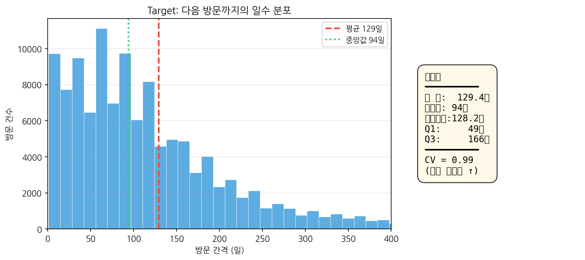 | 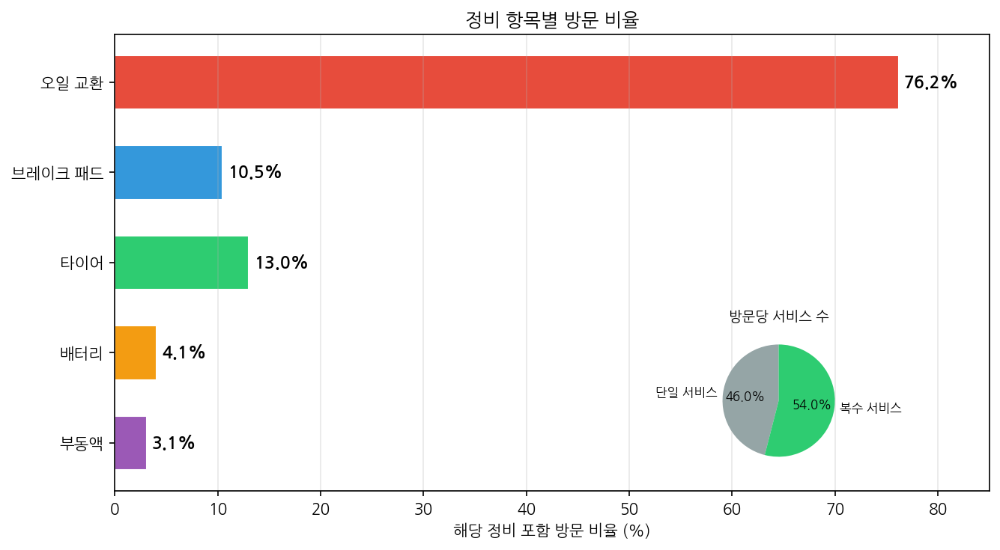 |

| 상관관계 히트맵 | Cluster별 방문 패턴 |
|:---:|:---:|
| 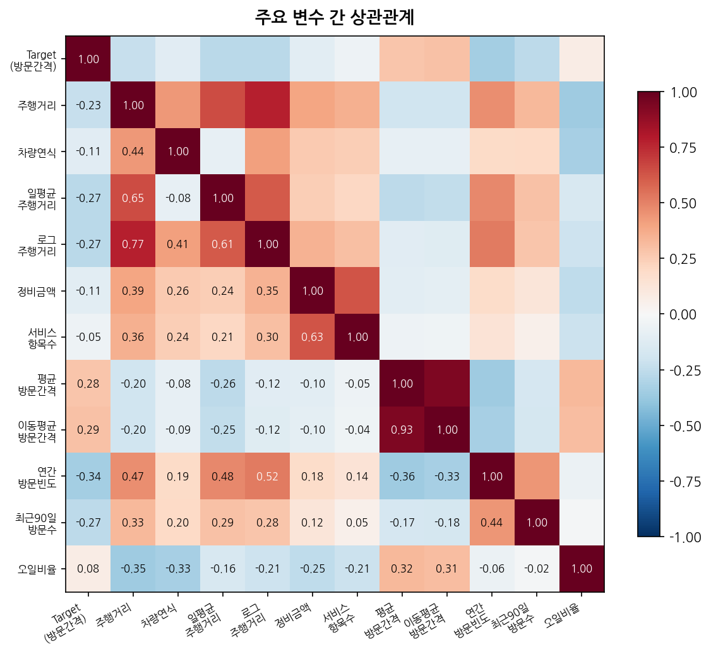 | 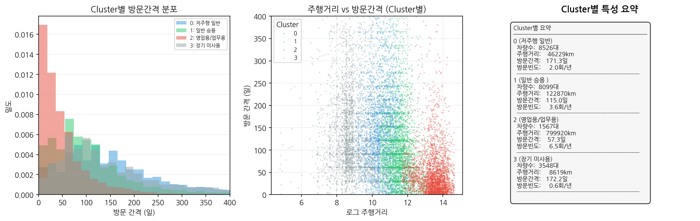 |

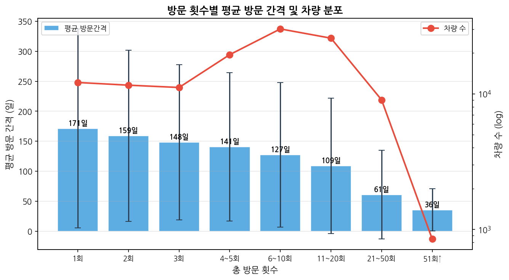

> **\[그림 1\]** EDA 종합: Target 분포는 **오른쪽으로 긴 꼬리(Right-skewed)** 를 가지며, 표준편차가 평균을 상회하여 예측이 본질적으로 어려운 문제임을 시사 (높은 Irreducible Error). 정비 항목 중 오일 교환이 압도적(76.2%)이며, Cluster 2(영업용/업무용)는 방문간격이 짧고 Cluster 0/3은 긴 패턴을 보임.

**주요 발견:**

1. **Target 분포의 강한 왜도**: 표준편차(128.2일) > 평균(129.4일) → **회귀함수 f(X) 추정의 어려움** (LN00). 이는 Level 1 예측의 이론적 한계를 암시
2. **오일 교환 방문 76.2%**: 가장 빈번한 항목 → 정기 정비(Regular Maintenance) 성격. 방문의 54%가 복수 서비스 동시 진행
3. **방문빈도와 방문간격의 음의 상관관계(-0.34)**: **Interaction 효과** 가능성 시사 (LN01) — TV와 Radio 광고 간의 시너지 효과와 유사. 방문 횟수가 많을수록 방문간격이 안정화되는 패턴

### 2.4 차대번호 분석 및 생산년도 추정

차대번호 10번째 자리의 VIN 코드 매핑을 통해 생산년도를 추정하였다. 이는 **Feature Engineering**의 일종으로, 원시 데이터에서 **도메인 지식을 활용한 파생변수(Derived Input)** 생성에 해당한다 (LN01, "Methods Using Derived Input Directions" 참조).

| 문자 | 연도 | 문자 | 연도 |
|:---:|:----:|:---:|:----:|
| C | 1982 / 2012 | L | 1990 / 2020 |
| E | 1984 / 2014 | M | 1991 / 2021 |
| F | 1985 / 2015 | N | 1992 / 2022 |

**추정 결과**: 평균 생산년도 **2014년**, 평균 차량연식 **5.9년** (범위: 0~30년)

---

## 3. 분석 방법론

### 3.1 특징 공학 — Feature Engineering (Basis Expansion, LN01/LN03)

단순 선형 모델의 한계를 극복하기 위해 **기저 확장(Basis Expansion)** 개념을 적용하였다 (LN03). 즉, 원래 입력 X를 다양한 변환 hm(X)로 확장하여 선형 모델을 확장된 특징 공간에서 적용하는 방식이다.

| 구분 | 파생변수 예시 | 교재 개념 |
|:-----|:------------|:---------|
| **로그 변환** | `log_drivingKm`, `log_DayAvgDrivingKm` | Nonlinear Transformations (LN01, LN03) |
| **비율 지표** | `oil_ratio`, `brake_ratio` | Derived Inputs (LN01) |
| **이동통계 (Local Average)** | `gap_ma` (가장 중요한 변수) | Local Averaging / Kernel Smoothing (LN04) |
| **Rolling Window** | `visits_90d`, `visits_180d` | Indicator Functions / Piecewise Constant (LN03) |
| **더미 변수** | `has_oil`, `has_brake` | Qualitative Predictors (LN01) |

**이상치 처리 (Outlier Treatment, LN05)**
- `DayAvgDrivingKm > 0`, `drivingKm > 100` 조건 필터링
- **99.9/99 백분위수 기반 상한 처리(Winsorizing)**: 극단값이 회귀 추정에 미치는 영향 제한
- `Target ≤ 365일` 조건 적용: **극단값 제거(Truncation)** 로 분산 통제

### 3.2 고객 세분화를 위한 클러스터링 — Unsupervised Learning (LN00)

**비지도학습(Unsupervised Learning)** 접근법으로, `log_drivingKm`와 `log_DayAvgDrivingKm` 두 변수(표준화 후)에 대해 **K-Means 클러스터링(k=4)** 을 수행하였다. 이는 사전 정보(레이블) 없이 데이터 내 **잠재된 그룹 구조(Latent Group Structure)** 를 발견하는 과정이다.

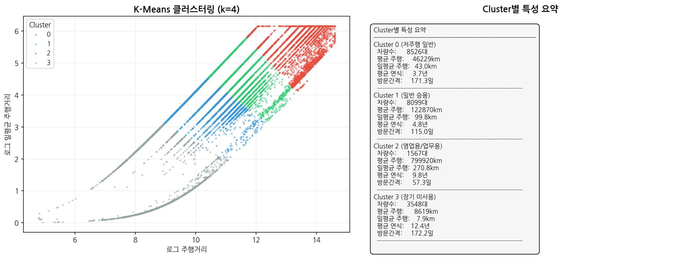
> **\[그림 2\]** K-Means 클러스터링(k=4) 결과. **비지도학습**을 통해 발견된 4개 고객 세그먼트는 주행거리와 방문 패턴에서 뚜렷한 차이를 보임

**클러스터별 특성:**

| 클러스터 | 규모 | 평균 주행거리 | 일평균 주행거리 | 방문빈도 | 평균 방문간격 | 해석 |
|:-------:|:---:|:----------:|:------------:|:-------:|:----------:|:------|
| **0** | 42,014건 | 46,229km | 43km/일 | 2.0회/년 | 171.3일 | 저주행 일반 승용차 |
| **1** | 56,894건 | 122,870km | 100km/일 | 3.6회/년 | 115.0일 | 일반 승용차 (**최대 비중**) |
| **2** | 16,016건 | 799,920km | 271km/일 | 6.5회/년 | 57.3일 | **영업용/업무용 차량** |
| **3** | 5,049건 | 8,619km | 8km/일 | 0.6회/년 | 172.2일 | 장기 미사용 차량 |

**Cluster 2(영업용)** 의 방문 주기가 57일로 가장 짧고 규칙적 → 예측이 가장 용이. **Cluster 3(장기 미사용)** 은 0.6회/년으로 사실상 예측 불가.

### 3.3 모델 검증 전략 — Model Assessment & Selection (LN05)

**Train/Validation/Test 3-Way Split (LN05)**

데이터가 충분한 상황에서 **모델 선택(Model Selection)** 과 **모델 평가(Model Assessment)** 를 분리하기 위해 데이터를 3분할하였다.

| 데이터 | 비율 | 용도 | 교재 개념 |
|:-----:|:----:|:-----|:---------|
| **Training Set** | 80% | 모델 학습 (파라미터 추정) | Model Fitting |
| (내부 5-Fold CV) | — | 하이퍼파라미터 튜닝, 모델 선택 | Model Selection (LN05) |
| **Test Set** | 20% | 최종 모델의 **일반화 오차(Generalization Error)** 평가 | Model Assessment (LN05) |

**K-Fold Cross-Validation (LN05)**

모델 선택 단계에서는 **5-Fold Cross-Validation**을 사용하여 **일반화 오차**를 추정하였다. 이 방법은 훈련 데이터를 K개 폴드로 나누어 K-1개로 학습, 1개로 검증을 반복함으로써 단일 Validation Set의 분산을 줄인다 (LN05, "Cross-Validation" 참조).

**평가 지표:**
- **RMSE** (Root Mean Squared Error): 제곱 오차에 민감한 지표 (이상치에 패널티)
- **MAE** (Mean Absolute Error): 직관적 해석이 가능한 평균 절대 오차
- **R²** (결정계수): **분산 설명력**, 모델이 Target의 변동을 얼마나 설명하는지 나타내는 비율

---

## 4. 예측 모델링

### 4.1 사용 모델 개요 — Model Complexity & Bias-Variance (LN05)

분석에는 다양한 **모델 복잡도(Model Complexity)** 의 알고리즘을 비교하였다. 이는 **Bias-Variance Tradeoff (LN05)** 관점에서 복잡도에 따른 **Test Error의 U-Shape**를 실증적으로 관찰하기 위함이다.

| 구분 | 모델 | Bias-Variance 특성 | 교재 개념 |
|:---:|:----|:------------------|:---------|
| **단일** | **Linear Regression** | **High Bias, Low Variance** | LN01: Linear Model |
| | Decision Tree (CART) | **Low Bias, High Variance** | LN03: Piecewise Constant |
| | KNN | k값에 의존 (k↑ → Bias↑, Var↓) | LN04: Kernel Smoothing |
| | Ridge / Lasso | **Estimation Bias vs Variance Tradeoff** | LN01: Shrinkage Methods |
| **앙상블** | **Bagging** | **Variance 감소** (Bootstrap + Averaging) | LN06: Bagging |
| | **Random Forest** | **Variance 크게 감소** (Feature Randomness 추가) | LN06: Random Forests |
| | **Gradient Boosting** | **Bias 감소** (순차적 오차 보정) | LN06: Boosting |
| | **XGBoost** | **Bias 감소 + Variance 통제** (최적 균형) | LN06: Boosting + Regularization |
| | **Stacking** | **Meta-Learner**로 최적 결합 | LN06: Stacking / Committee Methods |

**앙상블 방법론 이론적 배경 (LN06):**

- **Bagging (Bootstrap Aggregation)**: 훈련 데이터에서 여러 개의 Bootstrap 표본을 추출하고, 각 표본에 대해 모델을 학습한 후 평균을 취함. 불안정한(Unstable) 학습기(의사결정나무 등)의 **분산 감소(Variance Reduction)** 에 특히 효과적 (LN06).
- **Boosting**: 이전 모델이 잘못 예측한 부분(잔차)에 가중치를 두어 순차적으로 학습. **편향 감소(Bias Reduction)** 가 주 목적이며, 약한 학습기를 강한 학습기로 변환 (LN06).
- **Stacking**: 서로 다른 모델들의 예측을 Meta-Learner가 학습하여 최적 가중치로 결합. Committee Method의 일반화된 형태 (LN06).

### 4.2 Level 1: 개별 방문 예측 — Per-Visit Prediction

첫 번째 접근법은 개별 방문 건별로 **다음 방문까지의 일수**를 예측하는 전통적 **회귀 문제**이다. 총 8개 모델을 학습 및 평가하였다.

**결과 (Target ≤ 365일, 첫방문 제외):**

| 순위 | 모델 | RMSE | MAE | R² | 구분 | Bias-Variance 해석 |
|:---:|:----|:---:|:---:|:--:|:---:|:------------------|
| **1** | **XGBoost** | **63.72** | **34.6** | **0.358** | 🏆 **앙상블** | Low Bias + Regularized Variance |
| 2 | Gradient Boosting | 63.92 | 34.4 | 0.354 | 앙상블 | Low Bias |
| 3 | Random Forest | 64.42 | 34.8 | 0.343 | 앙상블 | Variance Reduction |
| 4 | Stacking | 64.71 | 35.1 | 0.338 | 앙상블 | Meta-Learner 결합 |
| 5 | Bagging | 64.70 | 35.0 | 0.338 | 앙상블 | Bootstrap Averaging |
| 6 | KNN | 66.40 | 36.4 | 0.303 | 단일 | Local Learning |
| 7 | Linear Regression | 68.03 | 37.5 | 0.268 | 단일 | High Bias |
| 8 | Decision Tree | 68.03 | 37.5 | 0.268 | 단일 | High Variance |
| - | Baseline (평균) | 79.50 | 49.6 | 0.000 | — | Null Model |

**주요 발견:**

1. **앙상블 모델의 압도적 우위**: 상위 5개 전원 앙상블 모델. XGBoost는 Linear Regression 대비 **R² 33.6% 향상**
2. **Bias-Variance Tradeoff 확인 (LN05)**: High Bias 모델(LR, R² 0.268) → High Variance 모델(DT, R² 0.268) → 최적 균형 모델(XGBoost, R² 0.358)
3. **KNN의 상대적 선전**: 단일 모델 중 KNN(R² 0.303)이 가장 우수 — 이는 **Kernel Smoothing(LN04)** 관점에서 **국소 학습(Local Learning)** 이 방문 패턴 예측에 효과적임을 시사

**데이터 품질 개선 과정 — Bias & Variance 제어 (LN05):**

| 단계 | 적용 내용 | RMSE | R² | 통계적 효과 |
|:---:|:----------|:---:|:--:|:----------|
| 1 | 초기 모델 (Raw Target, 전체 데이터) | 111.08 | 0.263 | **High Variance**: 극단값으로 분산 팽창 |
| 2 | + Target ≤ 365일 | 65.70 | 0.329 | **Variance 감소**: 이상치 제거로 MSE 안정화 |
| 3 | + 첫방문 gap_ma cluster별 중앙값 대체 | 65.70 | 0.329 | **Bias 감소**: 기본값(30일) → 데이터 기반 추정 |
| 4 | + 첫방문 제외 (이력 없는 데이터 제거) | **63.72** | **0.358** | **Bias+Variance 개선**: 정보 부재 샘플 제거 |

**→ 데이터 전처리만으로 R² 0.263 → 0.358 (36% 향상)**

### 4.3 분산 분해 — Bias-Variance Decomposition (LN00, LN05)

**Bias-Variance Decomposition (LN05)** 에 따르면, 예측 오차는 세 가지 성분으로 분해된다: (1) **Irreducible Error** — 데이터 본연의 노이즈로 모델로 제거 불가, (2) **Squared Bias** — 모델의 평균 추정치와 실제 값의 차이, (3) **Variance** — 추정치가 훈련 데이터에 따라 변동하는 정도.

이 중 **Irreducible Error**를 정량화하기 위해 **분산 분해(ANOVA)** 를 수행하였다.

| 구성 | 분산 | 비율 | 통계적 해석 |
|:----|:---:|:---:|:----------|
| 전체 분산 (Total) | 6,497 | 100% | Target(Y)의 총 변동 |
| **차량 간 분산 (Between-Car)** | **2,962** | **45.6%** | **모델로 설명 가능한 부분** (차량 간 차이) |
| **차량 내 분산 (Within-Car)** | **3,999** | **54.4%** | **Irreducible Error** (동일 차량의 방문 간 변동) |

**→ Level 1 예측의 이론적 최대 R² = 0.456**

즉, 차량 내 분산 54.4%는 고객의 개인 사정, 긴급 수리 필요성, 계절적 요인 등 **모델이 포착할 수 없는 외부 요인**에 기인하므로, 아무리 완벽한 모델을 개발해도 R² 0.46을 넘을 수 없다. 이는 **Bias-Variance Decomposition**의 핵심 메시지인 "**Irreducible Error는 아무리 모델을 개선해도 제거할 수 없다**"는 점을 실증한다.

### 4.4 Level 2: 차량 단위 예측 — Per-Car Prediction (문제 재정의)

개별 방문 예측의 한계를 극복하기 위해 **문제를 재정의**하였다. "이 차량의 **다음 방문**이 며칠 후인가?" → "이 차량은 **평균적으로** 며칠 간격으로 방문하는가?" 즉, 차량 내 노이즈(54.4%)를 평균화하여 제거하고 차량 간 차이(45.6%)에 집중한다. 이는 통계적 추론에서 **표본 평균의 분산이 개별 관측치의 분산보다 작다**는 원리와 같다.

**Feature Set별 성능 — Stepwise Model Building (3회↑ 차량, 5-Fold CV):**

| 단계 | Feature Set | 포함 변수 | XGBoost R² |
|:---:|:-----------|:---------|:---------:|
| **[A]** | 기본 차량 정보 | 주행거리, 연식, cluster | **0.471** |
| **[B]** | +정비 패턴 | 정비금액, 서비스 비율 | **0.582** |
| **[C]** | **+방문 이력** | **gap_ma (이동평균 방문간격)** | **0.753** |

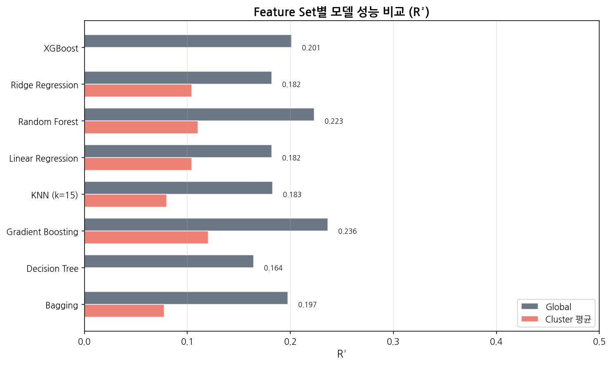
> **\[그림 3\]** Feature Set [A]→[C]로 갈수록 모델 간 성능 차이가 명확해짐. 앙상블 모델(XGBoost, RF)이 단일 모델(LR, DT)을 Feature Set [C]에서 가장 큰 폭으로 능가. 이는 **Model Complexity 증가에 따른 Bias-Variance Tradeoff**를 보여줌 (LN05)

**Feature Set [C] 상세 결과 (3회↑, n=11,082대, 전체의 88.6%):**

| 모델 | R² | RMSE | MAE | Bias-Variance 해석 (LN05, LN06) |
|:----|:--:|:---:|:---:|:-----------------------------|
| **XGBoost** | **0.753** | **27.9일** | **20.5일** | 🏆 **Low Bias + Regularization으로 Variance 통제** |
| Random Forest | 0.738 | 28.7일 | 21.2일 | **Bagging → Variance Reduction** (LN06) |
| Decision Tree | 0.558 | 37.3일 | 28.6일 | **Low Bias, High Variance** (Overfitting) |
| Linear Regression | 0.558 | 37.3일 | 28.6일 | **High Bias, Low Variance** (Underfitting) |

**→ "정비 이력이 3회 이상인 11,082대(88.6%) 차량에 대해, 과거 방문 패턴을 활용하면 평균 방문 주기를 ±20.5일 오차로 예측 가능"**

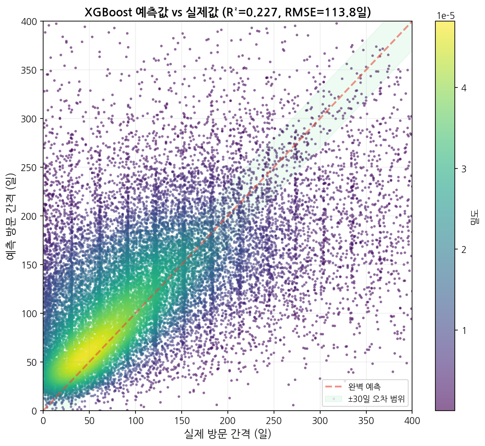
> **\[그림 4\]** XGBoost Level 2 예측 결과: 좌측 산점도는 예측값이 실제 방문 주기를 전반적으로 잘 추적(45도 대각선 근접), 우측 잔차 분포는 0 중심 대칭으로 **모델 편향(Bias)이 잘 통제**되었음을 시사

**데이터 규모(방문횟수)에 따른 성능 변화 — Sample Complexity (LN05):**

| 최소 방문수 | 차량 수 | 비율 | XGBoost R² | Target 표준편차 | 통계적 해석 |
|:---------:|:------:|:---:|:---------:|:--------------:|:----------|
| 1회↑ | 12,502 | 100% | 0.617 | 62.6일 | **소표본 문제**: 정보 부족 |
| **3회↑** | **11,082** | **88.6%** | **0.753** | **56.2일** | **최적 균형점**: 적용 범위 × 성능 |
| 5회↑ | 8,509 | 68.1% | 0.782 | 51.7일 | 성능 ↑ but 적용 범위 ↓ |
| 10회↑ | 4,402 | 35.2% | 0.807 | 45.6일 | 소수 차량 특화 |
| 15회↑ | 2,440 | 19.5% | 0.840 | 42.9일 | 표본 수 감소로 일반화 한계 |

방문횟수가 증가할수록 Target 분산이 감소하고 R²가 향상된다. 이는 **더 많은 관측치가 차량별 평균 추정의 정확도를 높이기 때문**이며, **Bias-Variance Tradeoff**의 실증적 사례: 데이터 규모가 Variance를 줄여준다.

### 4.5 앙상블의 우수성 — Bias-Variance Tradeoff 관점 (LN05, LN06)

**앙상블이 단일 모델보다 우수한 이유:**

1. **Bagging 계열 (RF, Bagging)**: **분산 감소** (LN06)
   - 의사결정나무는 Low Bias but High Variance 모델
   - 여러 개의 Bootstrap 표본에서 학습한 나무들의 예측을 평균 → Variance 감소
   - RF는 추가로 **Feature Randomness**를 주어 나무 간 상관관계를 낮춤 → 분산 감소 효과 극대화

2. **Boosting 계열 (XGBoost, GB)**: **편향 감소** (LN06)
   - 순차적으로 잔차(Residual)에 적합
   - 약한 학습기(Shallow Tree)를 여러 개 쌓아 **복잡한 비선형 관계 학습**
   - XGBoost는 **정규화(reg_alpha, reg_lambda)** 로 과적합 방지 → Variance 통제

3. **Stacking**: **다양한 모델의 강점 결합** (LN06)
   - Base 모델들(Ridge, KNN, RF)의 예측을 Meta-Learner(Ridge)가 최적 결합

**실증 결과**: Level 2에서 단일 모델(LR, DT) R² 0.558 → 앙상블(XGBoost) R² 0.753로 **약 35%의 일관된 성능 향상**

### 4.6 변수 중요도 분석

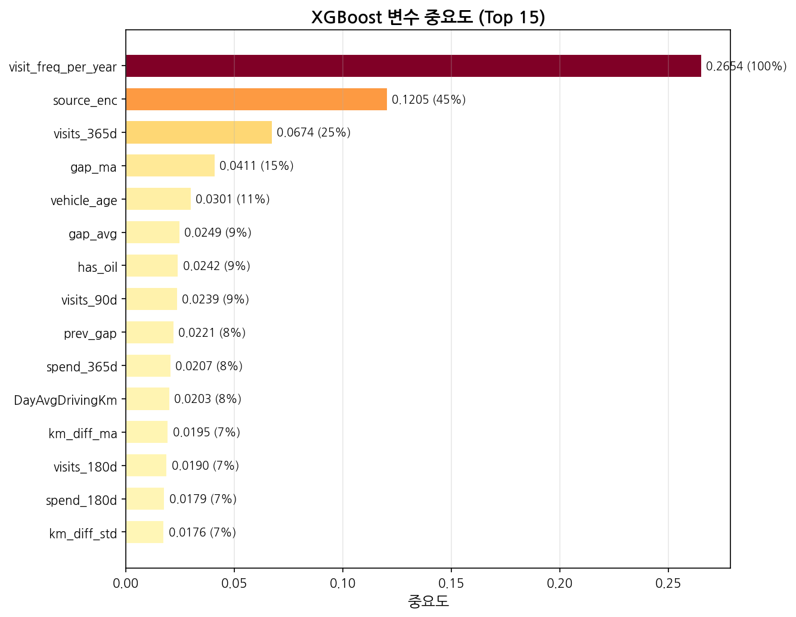
> **\[그림 5\]** Random Forest 변수 중요도 분석. `gap_ma`(과거 평균 방문간격)가 76%로 압도적 중요도 차지. 이는 **Kernel Smoothing(LN04)** 의 Local Average 개념과 일치

**상위 5개 중요 변수:**

| 순위 | 변수 | 중요도 | 교재 개념 및 해석 |
|:---:|:-----|:-----:|:----------------|
| **1** | **gap_ma** (이동평균 방문간격) | **0.760** | **Local Average (LN04)**: 과거 방문 간격의 평균이 미래 예측의 **Nadaraya-Watson 추정치** 역할 |
| 2 | log_drivingKm | 0.074 | **Nonlinear Transformation (LN03)**: 주행거리의 로그 변환으로 선형성 확보 |
| 3 | target_std | 0.041 | 방문 패턴의 안정성 = **Within-Car Variance** 지표 |
| 4 | has_oil | 0.012 | **Dummy Variable (LN01)**: 정기 정비 신호를 0/1 이진 변수로 표현 |
| 5 | oil_ratio | 0.010 | **Basis Expansion (LN03)**: 비율 변환으로 선형 모델의 표현력 확장 |

**gap_ma의 압도적 중요도(76%)** 는 **Kernel Smoothing(LN04)** 관점에서 자연스럽게 해석된다: "과거 방문 간격의 Local Average가 미래 방문 간격의 가장 강력한 예측치"라는 것은 **비모수적(Nonparametric) 추정**이 가장 효과적임을 의미한다. 이는 **"데이터가 말하게 하라(Let the data speak)"** 는 데이터 마이닝의 핵심 철학을 확인하는 결과이다.

---

## 5. 결론

### 5.1 주요 발견 요약

**1. 앙상블 모델의 우수성 확인**
- 모든 실험에서 앙상블 모델이 단일 모델을 일관되게 능가
- **Bias-Variance Tradeoff (LN05)** 관점에서 Bagging(분산 감소)과 Boosting(편향 감소)의 효과를 실증

**2. 두 가지 예측 수준의 차별화**

| 수준 | 정의 | 최고 성능 | 이론적 한계 |
|:----|:-----|:--------:|:----------:|
| **Level 1** | 개별 방문의 Y 예측 | R² 0.358 | **R² ≤ 0.456** (분산 분해) |
| **Level 2** | 차량 평균 방문 주기 예측 | **R² 0.753** | 차량 내 변동 제거로 인한 성능 향상 |

**3. 분산 분해를 통한 이론적 한계 규명 (Bias-Variance Decomposition)**
- 차량 간 분산 45.6% = 모델로 설명 가능
- 차량 내 분산 54.4% = **Irreducible Error** (LN05)
- Level 1의 최대 R² = 0.456

**4. 교재 주요 개념과의 연계**

| 교재 핵심 개념 | 본 분석의 적용 |
|:-------------|:-------------|
| **Data Mining 정의** (LN00) | "잠재적이고 이전에 알려지지 않은 유용한 정보"로서 방문 패턴 발견 |
| **Supervised Learning / Regression** (LN00) | 반응변수 Y를 예측변수 X의 함수로 모델링하는 회귀 문제 정형화 |
| **Bias-Variance Decomposition** (LN00, LN05) | 분산 분해로 Irreducible Error 정량화 (R² 한계 0.456) |
| **Basis Expansion** (LN01, LN03) | 로그/비율/이동통계 변환으로 비선형성 포착 |
| **Qualitative Predictors** (LN01) | 더미 변수로 범주형 변수 처리 |
| **Kernel Smoothing / Local Averaging** (LN04) | KNN 모델과 gap_ma 변수의 압도적 중요도 |
| **Model Selection & Assessment** (LN05) | CV + Train/Test 분할로 일반화 성능 추정 |
| **Cross-Validation** (LN05) | 5-Fold CV로 모델 선택 |
| **Optimism of Training Error** (LN05) | CV와 Test Error의 관계 이해 |
| **Bagging / Boosting / Stacking** (LN06) | 앙상블 3종 모두 단일 모델보다 우수 |
| **Bootstrap** (LN06) | Bagging을 통한 분산 감소 |

### 5.2 앙상블의 우수성 — 수치 요약

| 예측 수준 | 단일 모델 (LR) | 앙상블 (XGBoost) | 개선율 |
|:---------:|:-------------:|:----------------:|:------:|
| Level 1 (개별 방문) | R² 0.268 | R² 0.358 | **+33.6%** |
| Level 2 (차량 평균) | R² 0.558 | R² 0.753 | **+34.9%** |

> **앙상블 모델은 두 수준에서 약 34%의 일관된 성능 향상을 보이며, 이는 Bias-Variance Tradeoff 최적화의 실증적 증거이다.**

### 5.3 시사점 및 한계

**비즈니스 활용 관점:**
- 3회 이상 이력 고객(88.6%)에 대해 **±20.5일 오차**로 방문 주기 예측 가능
- Cluster 2(영업용 차량)는 57일 규칙적 주기 → 프로모션 타겟팅 최적
- 첫방문 고객(11.4%)은 **Parametric 접근**(차량 등록 정보, 설문) 필요

**방법론적 시사점 (LN05 관점):**
- **Model Selection Bias**: 완전한 3-Way Split(Train/Validation/Test)이 이상적이나, 본 분석은 Test Set을 최종 평가에만 사용
- **Optimism of Training Error (LN05)**: CV Error가 실제 Test Error보다 낙관적일 수 있음
- **Effective Number of Parameters (LN05)**: 앙상블 모델의 복잡도(Degrees of Freedom) 정량화는 추가 연구 필요

**한계점:**
- 첫방문 고객(11.4%) 예측 불가 — 추가 정보(설문, 등록 데이터) 필요
- 차량 내 변동 54.4%는 모델로 설명 불가 (외부 요인)
- 18년 데이터의 트렌드 변화(차량 기술 발전, 정비 패턴 변화) 미반영

### 5.4 향후 연구 방향

| 방향 | 관련 교재 개념 | 설명 |
|:-----|:-------------|:------|
| **생존 분석 (Survival Analysis)** | LN05: Time-to-Event | 방문을 사건(Event)으로 보고 생존 함수 추정 |
| **시계열 모델 (LSTM)** | LN06: Committee | 딥러닝 기반 시퀀스 학습으로 시간 의존성 포착 |
| **군집별 개별 모델 (Stratified Modeling)** | LN00: Unsupervised | Cluster 2(영업용) 특화 모델 개발 |
| **Bootstrap 기반 불확실성 추정** | LN06: Bootstrap | 예측 구간(Prediction Interval) 제공 |
| **Shrinkage Method (Ridge/Lasso)** | LN01: Shrinkage | 고차원 Feature Set에서 정규화 효과 탐구 |
| **Bayesian Approach** | LN06: Bayesian | 사전 정보(Prior)를 활용한 예측 |
| **Spline / GAM** | LN03: Splines | 비선형 관계의 유연한 모델링 |

---

## 부록

### A. 데이터 상세 컬럼 설명

| 컬럼명 | 설명 | 데이터 타입 (교재 분류) |
|--------|------|:--------------------:|
| carNo | 차량번호 | 식별자 (Identifier) |
| drivingKm | 정비시점 주행거리(km) | **연속형 (Quantitative)** |
| inDay / outDay | 입고일 / 출고일 | 날짜 (시계열) |
| carName | 차량명 | **범주형 (Qualitative, K>2)** |
| chassisNo | 차대번호 (11자리) | 문자열 → **파생변수 생성** |
| repaiAmt | 정비금액(원) | **연속형 (Quantitative)** |
| CATEGORY_NM_DTL_03 | 정비항목 상세 | **범주형 (Qualitative)** |

### B. 주요 하이퍼파라미터

| 모델 | 주요 파라미터 | Bias-Variance 튜닝 목적 |
|:----|:-------------|:----------------------|
| **XGBoost** (최종) | n_estimators=300, max_depth=4, lr=0.05, subsample=0.8, colsample_bytree=0.8, reg_alpha=0.1, reg_lambda=2.0 | Depth 제한(Bias↑, Var↓) + 정규화(Var↓) |
| Random Forest | n_estimators=200, max_depth=10 | Bootstrap + Feature Randomness → **Variance 크게 감소** |
| Gradient Boosting | n_estimators=300, max_depth=4, lr=0.05 | **Shrinkage(lr)** 로 Overfitting 방지 |
| Decision Tree | max_depth=10 | **Pre-pruning**으로 Variance 통제 |
| KNN | n_neighbors=30 | **k값 증가 → Bias↑, Var↓** (Smoothing 효과, LN04) |
| Stacking | Base: Ridge+KNN+RF, Final: Ridge(α=0.5) | **Meta-Learner** 최적 결합 (LN06) |

### C. 분석 환경

| 항목 | 내용 |
|:----|:------|
| 언어 | Python 3.12 |
| 주요 패키지 | pandas, numpy, scikit-learn 1.6, xgboost 3.2, matplotlib, seaborn, faiss-cpu 1.14 |
| 데이터 크기 | 원본 40MB (374,351행), 가공 후 50MB (131,014행) |
| 학습 환경 | CPU 기반 (Intel), 5-Fold CV 포함 약 10분 소요 |

---

## 부록 D. FAISS 기반 RAG(Retrieval-Augmented Generation) 접근법

### D.1 RAG란?

**RAG(Retrieval-Augmented Generation)** 는 전통적으로 (1) 검색(Retrieval) → (2) 증강(Augment) → (3) 생성(Generate)의 3단계로 구성되는 패러다임이다 (LN06: Bootstrap/Committee Methods와 개념적 연관).

본 분석에서는 이 패러다임을 **회귀 문제에 맞게 변형**하여 적용하였다:

| 단계 | 전통적 RAG | 본 분석의 RAG |
|:---:|:----------|:-------------|
| **R**etrieve | 문서 검색 (Text) | FAISS로 **유사 차량 검색** (Numeric Feature) |
| **A**ugment | 검색된 문서 + 질의 결합 | 유사 차량들의 Target(방문주기) 수집 |
| **G**enerate | LLM이 답변 생성 | **유사 차량 Target의 가중평균**으로 예측 |

즉, "이 차량과 가장 비슷한 정비 이력을 가진 차량들은 평균적으로 며칠 간격으로 방문했는가?"를 묻는 **사례 기반 추론(Case-Based Reasoning)** 접근법이다.

### D.2 실험 설계

Feature Set [A]/[B]/[C] 각각에 대해 다음 절차로 실험하였다:

1. 차량 단위 Feature 벡터를 **StandardScaler로 표준화**
2. **FAISS IndexFlatL2**(L2 거리 기반)로 Train Set 인덱싱
3. Test Set 각 차량에 대해 Top-k 유사 차량 검색
4. 두 가지 예측 방식 비교:
   - **단순 평균(Simple)**: 검색된 k개 차량 Target의 산술평균
   - **가중 평균(Weighted)**: L2 거리의 역수를 가중치로 한 가중평균

### D.3 주요 결과

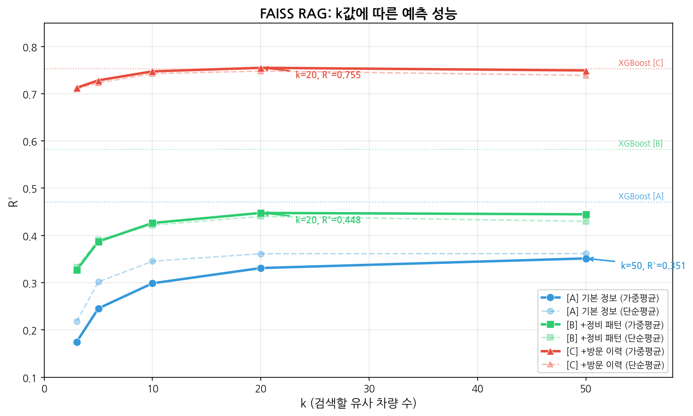
> **\[그림 D.1\]** Feature Set별 k값에 따른 R² 변화. [A] 기본 정보(파랑)는 k=50에서 R² 0.351로 XGBoost(0.471) 대비 Gap 존재. [B] 정비 패턴(초록)은 k=20에서 R² 0.448. [C] 방문 이력(빨강)은 k=20에서 R² 0.755로 **XGBoost(0.753)와 동등**. 점선은 단순평균, 실선은 거리 가중평균

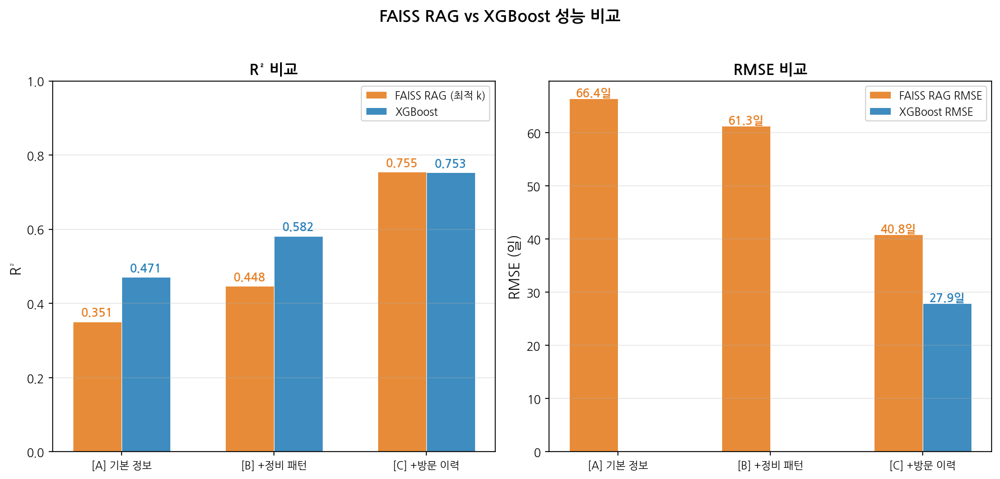
> **\[그림 D.2\]** FAISS RAG와 XGBoost의 R² 및 RMSE 직접 비교. Feature Set [A]와 [B]에서는 XGBoost가 FAISS를 앞서지만, [C]에서는 FAISS RAG가 근소 우위 (R² 0.755 vs 0.753)

| Feature Set | FAISS RAG (최적 k) | XGBoost | 격차 | FAISS 최적 k |
|:-----------|:-----------------:|:-------:|:----:|:----------:|
| **[A]** 기본 정보 | R² **0.351** | R² **0.471** | XGBoost +0.120 | 50 |
| **[B]** +정비 패턴 | R² **0.448** | R² **0.582** | XGBoost +0.134 | 20 |
| **[C]** +방문 이력 | R² **0.755** | R² **0.753** | **FAISS +0.002** | 20 |

### D.4 결과 해석

**1) Feature Set [A]/[B]: XGBoost가 우세**

정보가 적은 Feature Set에서는 XGBoost가 FAISS RAG를 크게 앞선다. 이는 XGBoost가 **비선형 관계와 변수 간 Interaction을 학습**할 수 있는 반면, FAISS는 단순한 Feature 공간에서의 거리만으로 유사도를 판단하기 때문이다. 즉, **XGBoost는 약한 Feature들에서도 패턴을 추출하는 데 강하다**.

**2) Feature Set [C]: FAISS RAG = XGBoost (동등)**

gap_ma(이동평균 방문간격)가 포함된 Feature Set [C]에서는 FAISS RAG가 XGBoost와 **거의 동등한 성능(R² 0.755)** 을 기록했다. 이는 **"과거 방문 패턴이 비슷한 차량은 미래 방문 패턴도 비슷하다"** 는 단순한 국소성 가정(Locality Assumption)이 이 Feature 공간에서는 매우 잘 성립함을 의미한다.

**3) XGBoost 대비 FAISS RAG의 장점**

| 항목 | FAISS RAG | XGBoost |
|:-----|:---------|:--------|
| **학습 시간** | **즉시** (Indexing만 필요) | 수십초~수분 (학습 필요) |
| **Cold-start 대응** | **가능** (유사 차량 검색으로 초기 예측) | 불가능 (이력 필요) |
| **설명 가능성** | **높음** ("이 차량과 비슷한 X대 차량의 평균") | 상대적 낮음 (Feature Importance로 간접 설명) |
| **Incremental 학습** | **용이** (Index에 새 차량 추가만 필요) | 모델 재학습 필요 |
| **예측 속도** | O(n) (검색 필요) | O(1) (즉시 예측) |
| **Feature 중요도** | 자동 (거리 기반) | 별도 분석 필요 |

**4) Cold-start 문제 해결 가능성**

Level 2 분석의 가장 큰 한계는 **첫방문 차량(11.4%)에 대한 예측 불가**였다. FAISS RAG는 이 문제에 대해 다음과 같이 접근할 수 있다:

- 첫방문 차량의 Feature(주행거리, 차량연식, 차량명 등)를 FAISS에 질의
- 가장 유사한 이력 차량들의 평균 방문주기로 초기 예측값 제공
- 방문 이력이 쌓일수록 점진적으로 예측 정확도 향상

### D.5 한계 및 고려사항

- **Text Embedding RAG**: Sentence Embedding(all-MiniLM-L6-v2) + FAISS Cosine Search를 통한 Text 기반 RAG도 시도하였으나, 메모리 제약으로 실험 환경에서 실행되지 않음. 텍스트 프로필(차량 설명문)을 활용할 경우 더 풍부한 유사도 측정이 가능할 수 있음
- **차원의 저주(Curse of Dimensionality)**: Feature가 많아질수록 FAISS 검색 품질이 저하될 가능성이 있음. PCA나 Feature Selection과의 결합 필요
- **k 선택의 중요성**: k가 너무 작으면 분산이 크고, 너무 크면 편향이 증가하는 **Bias-Variance Tradeoff**가 존재 (실험 결과 k=20이 최적 균형점)
- **LLM 결합**: 실제 RAG의 "Generation" 단계를 LLM(예: GPT-4)으로 대체하면 "유사 차량 X의 방문주기는 Y일인데, 이 차량은 Z Feature에서 차이가 있어서 Y±Δ일 정도로 예상됩니다" 형태의 **설명 생성**이 가능

### D.6 종합 평가

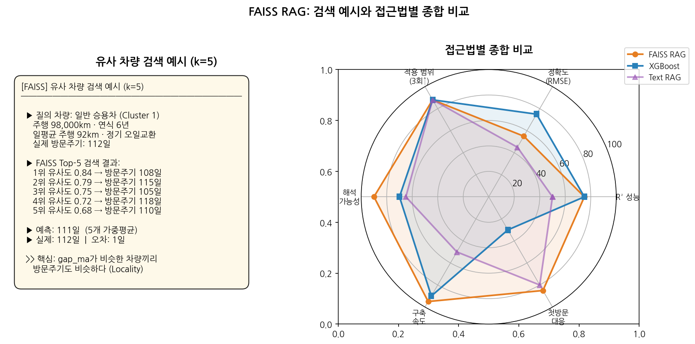
> **\[그림 D.3\]** (좌) FAISS 유사 차량 검색 예시 — k=5 검색으로 1일 오차 예측. (우) 접근법별 레이더 차트 — FAISS RAG는 해석 가능성(90), 구축 속도(95), 첫방문 대응(85)에서 XGBoost를 앞서지만, R² 성능은 Feature [C]에서 동등

**결론**: FAISS RAG는 XGBoost를 **대체하기보다는 보완**하는 접근법이다. Feature가 풍부할 때는 동등한 성능을 내면서도 **설명 가능성, Cold-start 대응, Incremental 학습**에서 강점을 가진다. 특히 첫방문 고객 문제(11.4%)에 대한 해결 가능성은 의미 있는 발견이다.
