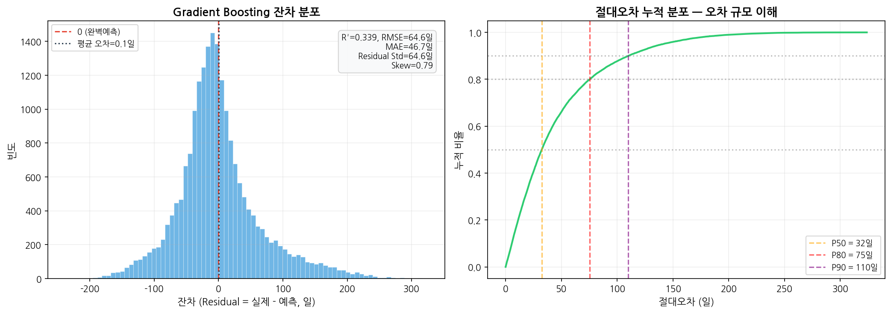
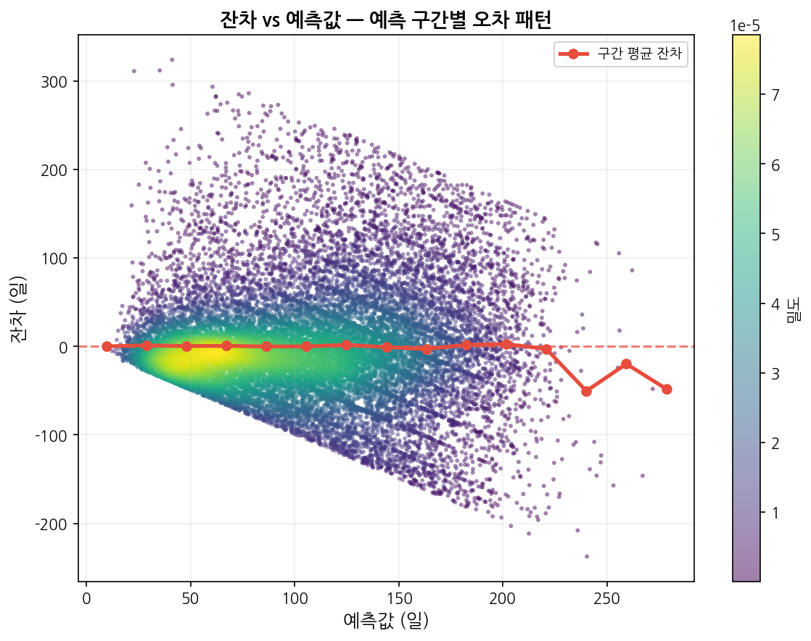
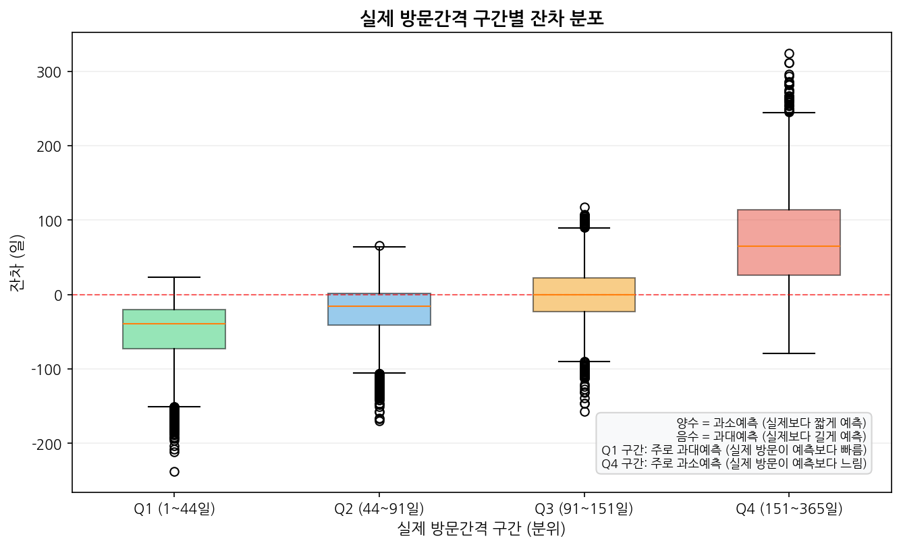
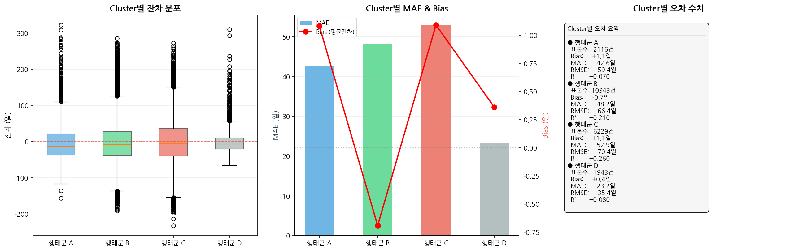
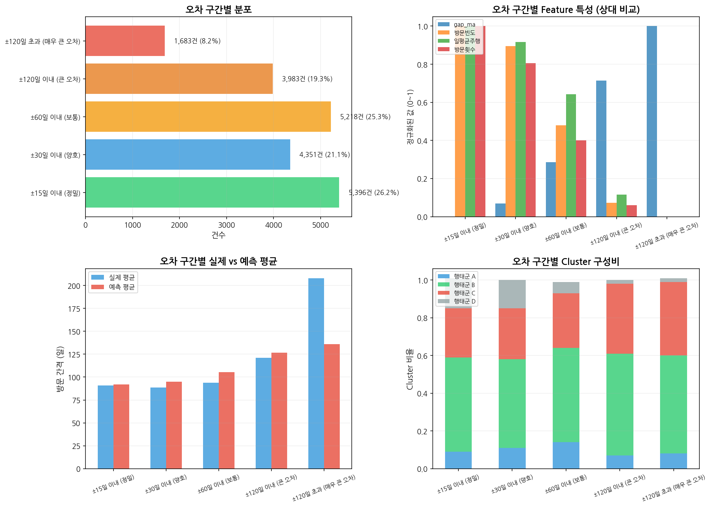
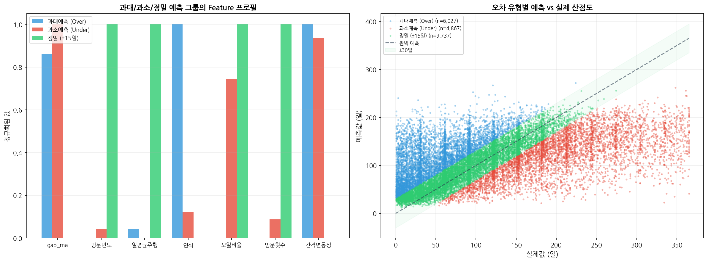
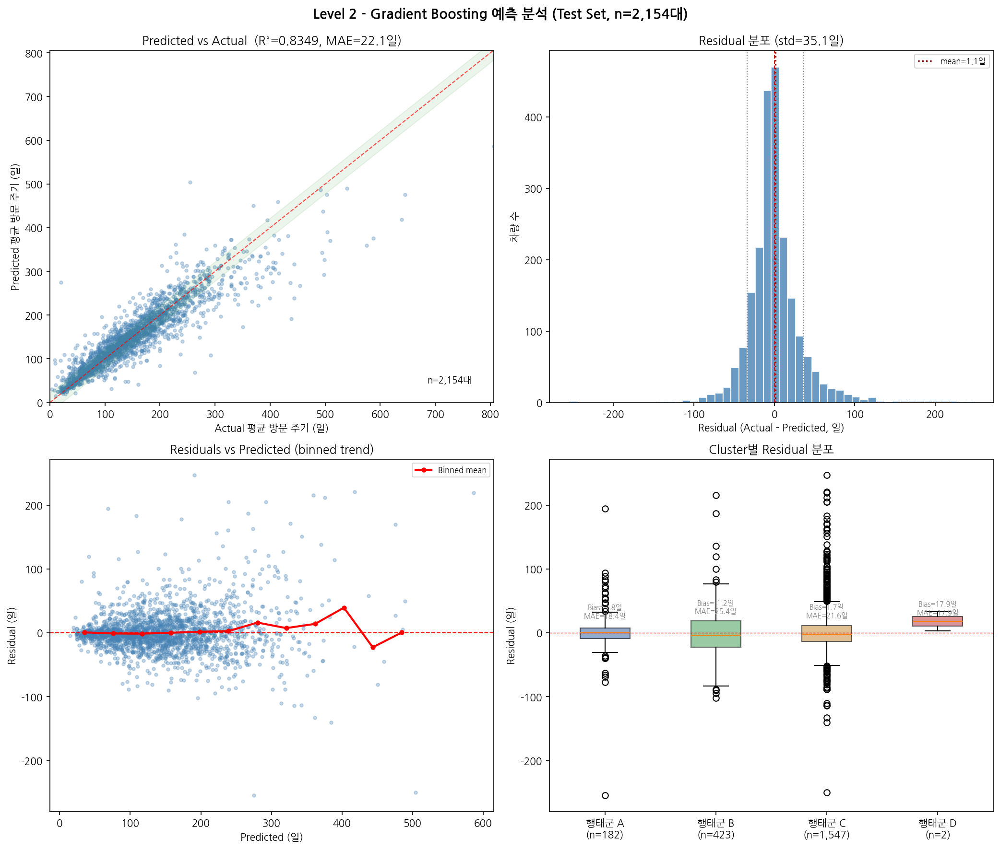
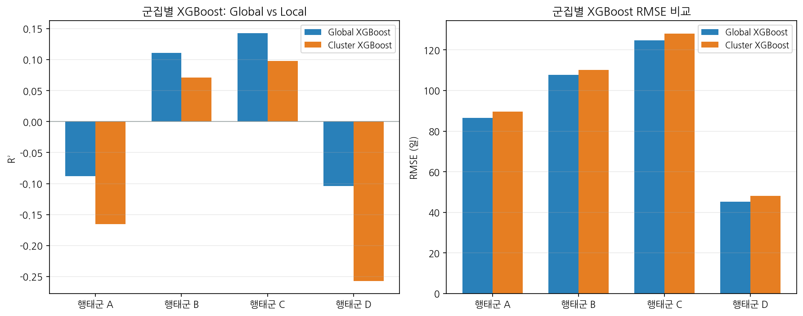

# 차량 정비 데이터를 활용한 다음 방문 예측 분석 보고서
## 단일 모델 vs 앙상블 모델 성능 비교

---

## 1. 서론

### 1.1 데이터 마이닝의 개요

**데이터 마이닝(Data Mining)** 이란 방대한 데이터로부터 **잠재적이고(implicit), 이전에 알려지지 않았으며, 잠재적으로 유용한**(previously unknown and potentially useful) 정보를 추출하는 과정이다 (LN00). 차량 정비소는 수년간 고객의 정비 이력을 축적하고 있지만, 이 데이터는 단순 기록(Data)에 머물러 있을 뿐 **고객 방문 패턴이라는 정보(Information)** 로 전환되지 못하고 있다.

본 분석은 **지도학습(Supervised Learning)** 패러다임 (LN00) 하에서, 과거 정비 이력 데이터로부터 다음 방문 시점을 예측하는 **회귀(Regression) 문제**로 정의된다. 즉, 연속형 반응변수 Y (다음 방문까지의 일수)를 예측변수 X (차량 정보, 정비 이력 등)의 함수로 모델링하는 것이다. 여기서 회귀함수(Regression Function)는 알려지지 않은 함수이며, 오차항(Irreducible Error)은 모델로 설명되지 않는 본질적 노이즈를 의미한다 (LN00).

### 1.2 분석 목적

1. **차량 정비 이력 데이터**를 활용한 방문 예측 모델 개발
2. **단일 모델**(선형회귀, 의사결정나무, KNN)과 **앙상블 모델**(배깅, 랜덤포레스트, 그래디언트 부스팅, XGBoost, 스태킹)의 성능 비교
3. **클러스터링(Unsupervised Learning)** 을 통한 차량군 세분화와 재방문 패턴 이질성 확인
4. 여러 모델을 비교하고, 결과를 **Bias-Variance 해석 프레임**으로 정리 (LN05, LN06)
5. **예측 결과를 CRM(고객 관계 관리) 문자 발송 운영 기준**으로 활용하기 위한 해석 프레임 제시

### 1.3 데이터 마이닝 관점의 문제 정의

본 문제는 **회귀(Regression)** 문제이며, 실제 정비소 CRM 운영 관점에서 두 가지 수준으로 나누어 접근하였다:

- **Level 1 (Per-Visit Prediction)**: 개별 방문 건에 대해 다음 방문까지의 일수 예측 — 과학적 호기심에 가까우며, 높은 개별 변동성으로 인해 실시간 운영 의사결정에 직접 쓰기는 어려움
- **Level 2 (Per-Car Prediction)**: 차량 단위의 평균 방문 주기 예측 — **"이 고객은 평균적으로 며칠 간격으로 방문하는가?"** 라는 CRM의 핵심 질문에 답하며, **문자 리마인드 발송 시점 결정**이라는 실전 운영 기준을 제공

정리하면 Level 1은 개별 방문의 변동성을 탐구하는 분석적 과제이고, Level 2는 **"언제, 누구에게 문자를 보낼 것인가"** 라는 CRM 의사결정을 지원하는 실용적 과제이다.

### 1.4 보고서 읽는 가이드

이 보고서는 다음 순서로 읽으면 가장 이해하기 쉽다.

1. **2장 데이터의 이해**: 원천 데이터가 무엇이고, 어떤 전처리와 특징 공학을 거쳐 학습데이터가 만들어졌는지 설명
2. **3장 분석 방법론**: 군집화 기준, 평가 방식, 최종 학습데이터의 형태를 설명
3. **4장 예측 모델링**: Level 1/Level 2 결과와 변수 중요도를 비교
4. **5장 결론**: 핵심 결과와 한계를 요약

처음 읽는 경우에는 **2.2 전처리 → 2.3 특징 공학 → 3.3 최종 학습데이터 예시 → 4장 결과** 순서로 보면 전체 흐름을 더 빠르게 이해할 수 있다.

---

## 2. 데이터의 이해

이 장에서는 **원천 데이터가 어떤 형태인지**, **전처리 후 어떤 분석 단위로 바뀌는지**, 그리고 **모델이 실제로 어떤 변수들을 입력으로 받는지**를 순서대로 설명한다.

### 2.1 데이터 수집 및 구조

본 분석에 사용된 데이터는 차량 정비 업무 관리 시스템에서 수집된 실제 정비 이력 데이터로, 두 개의 CSV 파일로 구성되어 있다. 두 파일은 **동일한 컬럼 구조를 공유**하므로, 분석 단계에서는 `source` 변수만 추가한 뒤 **세로 결합(concatenate)** 하여 하나의 방문 이력 데이터셋으로 사용하였다. 즉, 본 보고서의 주목적은 **파일 간 비교**가 아니라 **통합 이력 기반 예측/세분화 분석**이다.

| 파일 | 행 수 | 차량 수 | 기간 | 크기 |
|------|-------|---------|------|------|
| DB적재_A.csv | 195,843건 | 6,767대 | 2005.12 ~ 2023.12 | 18MB |
| DB적재_B.csv | 178,508건 | 6,927대 | 2010.01 ~ 2023.05 | 22MB |
| **합계** | **374,351건** | **13,693대** | **2005~2023년 (18년)** | **40MB** |

**두 파일의 차이점 요약:**
- **A**: 2005.12부터 시작하여 관측 기간이 더 김
- **B**: 2010.01부터 시작하며 종료 시점이 다소 빠름
- 분석에서는 두 파일을 별도 모델로 비교하지 않았고, `source`를 보조 변수로만 유지하였다.

아래 표는 두 원천 파일에서 가져온 **raw 데이터 예시 5행**이다.

| source | carNo | inDay | outDay | drivingKm | repaiAmt | carName | chassisNo | CATEGORY_NM_DTL_03 |
|------|------|------|------|----------:|---------:|--------|----------|--------------------|
| A | **** | 2019-03-19 | 2019-03-19 | 89000 | 44000 | HG그랜져 | **** | 변속기(트랜스미션) |
| A | **** | 2019-03-19 | 2019-03-19 | 89000 | 44000 | HG그랜져 | **** | 미션오일 |
| A | **** | 2023-06-01 | 2023-06-01 | 520887 | 66000 | Arocs 3251K 8*4/4 | **** | 제동 마스터백/실린더 |
| B | **** | 2010-08-11 | 2010-08-12 | 3358 | 4290 | 5시리즈 (7세대) | **** | 오일 |
| B | **** | 2010-08-11 | 2010-08-12 | 3358 | 24430 | 5시리즈 (7세대) | **** | 오일 |

이 예시에서 중요한 점은, **원본 데이터 1행이 차량 1대 전체를 뜻하는 것이 아니라 방문 중 수행된 서비스 항목 1건**이라는 점이다. 예를 들어 A 예시 1~2행은 **같은 차량, 같은 날짜 방문**이지만 정비 항목이 달라 **2개의 행**으로 기록되어 있다. B 예시에서도 동일한 방문이 여러 행으로 나뉘어 존재한다.

**주요 원천 변수:**

| 변수명 | 설명 | 분석에서의 역할 | 데이터 타입 (교재 분류) |
|--------|------|----------------|:--------------------:|
| `carNo` | 차량을 구분하는 고유 식별자 | 차량별 이력 정렬, 방문 집계, 차량 단위 평균 계산의 기준 키 | 식별자 (Identifier) |
| `inDay` | 정비소 입고일 | 방문 시점 정의, 이전/다음 방문 간격 계산의 기준 날짜 | 날짜 |
| `outDay` | 정비소 출고일 | 방문 단위 집계 시 보조 정보로 유지 | 날짜 |
| `drivingKm` | 해당 방문 시점 누적 주행거리(km) | 주행량 수준 파악, 주행거리 증가분 및 클러스터링 변수 생성의 기반 | **연속형** |
| `repaiAmt` | 해당 행의 정비 금액(원) | 방문별 총 지출액 집계, 최근 지출 패턴 변수 생성의 기반 | **연속형 (Quantitative)** |
| `carName` | 차량명/차종 정보 | 직접 모델에 쓰기보다 차량 속성 해석과 보조 설명에 활용 가능 | **범주형 (Qualitative)** |
| `chassisNo` | 차대번호(11자리) | 10번째 문자로 생산년도(`prod_year`)를 추정하는 파생변수 생성에 활용 | 문자열 |
| `CATEGORY_NM_DTL_03` | 정비 항목 상세 분류 | 서비스 항목 리스트 생성, 더미변수(`has_oil` 등)와 비율변수(`oil_ratio` 등)의 기반 | **범주형 (Qualitative, K>2)** |


위 변수들은 원본 CSV의 행 단위(= 서비스 항목 단위) 정보이며, 실제 분석은 이를 그대로 사용하지 않고 **방문 단위 집계 → 파생변수 생성 → 모델링용 Feature 구성**의 순서로 진행하였다.

### 2.2 데이터 전처리

**1) 방문 단위 집계**

원본 데이터는 한 번의 방문에서 여러 정비 항목이 개별 행으로 기록되어 있다. 이를 (차량번호, 입고일) 기준으로 집계하여 **분석 단위를 '방문'으로 변환**하였다.

| 구분 | 값 |
|------|-----|
| 원본 행 수 | 374,351건 |
| 방문 단위 집계 후 | 145,247건 |
| 방문당 평균 서비스 항목 수 | 2.56개 |
| 복수 서비스 방문 비율 | 54.0% |

**2) Target 변수 생성**

차량별 방문 이력을 시간순 정렬 후, **다음 방문까지의 일수(days_until_next)** 를 Target(Y)으로 설정. 마지막 방문(다음 방문 없음)과 1일 미만 또는 3년(1,095일) 초과 극단값은 분석에서 제외.

**3) 범주형 변수 처리 — Qualitative Predictors (LN01)**

범주형 변수(정비 항목, 서비스 유형 등)는 **더미 코딩(Dummy Variables)** 으로 변환하였다. K개의 범주를 가진 변수는 K-1개의 더미 변수로 표현된다 (예: `has_oil = I(정비항목 == "오일")`, 기준 범주는 기타). (LN01, "Qualitative Predictors" 절 참조)

**4) 방문 단위에서 새로 만들어진 핵심 변수**

| 변수명 | 설명 | 예시 해석 |
|--------|------|----------|
| `service_items` | 한 번의 방문에서 수행된 정비 항목 목록 | 오일+타이어 교체가 같은 방문에서 함께 기록될 수 있음 |
| `n_services` | 한 방문에 포함된 정비 항목 수 | 값이 3이면 해당 방문에서 3개 작업이 동시에 수행된 것 |
| `next_visit_date` | 동일 차량의 다음 입고일 | Target 계산을 위한 중간 변수 |
| `days_until_next` | 현재 방문 이후 다음 방문까지 걸린 일수 | 본 분석의 Target(Y) |
| `source` | 원천 파일 구분 (`A`/`B`) | 두 파일을 합친 뒤 출처 차이를 확인하는 보조 변수 |

**전처리 결과를 한 줄로 요약하면**: 원본의 서비스 항목 단위 데이터를 **방문 단위 데이터**로 바꾸고, 각 방문에 대해 **다음 방문까지의 간격(`days_until_next`)** 을 타깃으로 만드는 과정이다.

### 2.3 차대번호 분석 및 특징 공학

이 절의 목적은 **원시 컬럼을 바로 쓰지 않고, 예측에 더 유용한 형태로 바꾸는 과정**을 설명하는 것이다. 즉, 차량의 주행 강도, 방문 주기, 정비 성향을 직접 나타내는 변수를 새로 만든다.

분석에 사용된 다수의 설명변수는 원천 컬럼을 그대로 사용한 것이 아니라, **원천 데이터로부터 의미 있는 파생변수를 생성하는 특징 공학(Feature Engineering)** 과정을 통해 만들어졌다. 이는 원시 입력 X를 더 설명력 있는 입력으로 변환하는 과정이며, 본 보고서에서는 데이터 이해의 일부로 보는 것이 자연스럽다. 가장 대표적인 예가 **차대번호 기반 생산년도 추정**이다.

| 문자 | 연도 | 문자 | 연도 |
|:---:|:----:|:---:|:----:|
| C | 1982 / 2012 | L | 1990 / 2020 |
| E | 1984 / 2014 | M | 1991 / 2021 |
| F | 1985 / 2015 | N | 1992 / 2022 |

**추정 결과**: 평균 생산년도 **2014년**, 평균 차량연식 **5.9년** (범위: 0~30년)

단순 선형 모델의 한계를 극복하기 위해 **기저 확장(Basis Expansion)** 개념을 적용하였다 (LN03). 즉, 원래 입력 X를 다양한 변환 hm(X)로 확장하여 선형 모델을 확장된 특징 공간에서 적용하는 방식이다.

분석에 사용된 변수는 크게 **(1) 원천 변수, (2) 방문 이력 기반 파생변수, (3) 차량 단위 요약변수**로 나눌 수 있다. 아래 표는 실제 코드에서 생성된 대표 파생변수와 그 의미를 정리한 것이다.

| 구분 | 파생변수 예시 | 교재 개념 |
|:-----|:------------|:---------|
| **로그 변환** | `log_drivingKm`, `log_DayAvgDrivingKm` | Nonlinear Transformations (LN01, LN03) |
| **비율 지표** | `oil_ratio`, `brake_ratio` | Derived Inputs (LN01) |
| **이동통계 (Local Average)** | `gap_ma` (가장 중요한 변수) | Local Averaging / Kernel Smoothing (LN04) |
| **Rolling Window** | `visits_90d`, `visits_180d` | Indicator Functions / Piecewise Constant (LN03) |
| **더미 변수** | `has_oil`, `has_brake` | Qualitative Predictors (LN01) |

**대표 파생변수 상세 설명**

| 변수명 | 생성 방식 | 의미 | 분석상 역할 |
|--------|----------|------|------------|
| `prod_year` | 차대번호 10번째 문자 해석 | 차량 생산년도 추정치 | 차량 연식 계산의 기반 |
| `vehicle_age` | `inDay.year - prod_year` | 정비 시점 차량 연식 | 노후화 정도 반영 |
| `AnnualAvgDrivingKm` | `drivingKm / vehicle_age` | 연평균 주행거리 | 누적 주행거리를 연식으로 보정 |
| `DayAvgDrivingKm` | `AnnualAvgDrivingKm / 365` | 일평균 주행거리 | 클러스터링과 주행 강도 해석의 핵심 변수 |
| `log_drivingKm` | `log1p(drivingKm)` | 누적 주행거리의 로그 변환 | 왜도 완화, 거리 기반 비교 안정화 |
| `log_DayAvgDrivingKm` | `log1p(DayAvgDrivingKm)` | 일평균 주행거리의 로그 변환 | 클러스터링 입력 변수 |
| `visit_count` | 차량별 방문 순서(`1,2,3,...`) | 현재 관측이 몇 번째 방문인지 | 초기 방문/누적 이력 구분 |
| `prev_gap` | 직전 방문과 현재 방문 간격 | 바로 이전 방문 주기 | 단기 방문 패턴 반영 |
| `gap_avg` | 과거 방문 간격 평균 | 장기 평균 방문 주기 | 차량별 평균 패턴 반영 |
| `gap_ma` | 최근 3회 방문 간격 평균 | 최근 방문 패턴의 이동평균 | 모델/FAISS에서 가장 중요한 이력 변수 |
| `gap_std` | 과거 방문 간격 표준편차 | 방문 간격의 불안정성 | 변동성 반영 |
| `km_diff_avg` | 방문 간 주행거리 증가분 평균 | 방문 사이 주행량 증가 속도 | 사용 강도 추정 |
| `total_spend` | 과거 방문 금액 누적합 | 누적 정비비용 | 유지비 규모 반영 |
| `avg_spend`, `max_spend`, `spend_ma` | 평균/최대/최근 평균 정비비 | 지출 패턴 | 비용 기반 방문 성향 반영 |
| `service_diversity` | 과거 정비 항목 종류 수 | 정비 유형의 다양성 | 단순 소모품 위주 vs 다양한 정비 구분 |
| `oil_ratio`, `brake_ratio`, `tire_ratio` | 과거 서비스 중 특정 항목 비율 | 정비 성향 지표 | 정기정비 성향/부품 중심 성향 반영 |
| `visit_freq_per_year` | 누적 방문수 ÷ 관측기간(년) | 연간 방문 빈도 | 방문 강도의 핵심 지표 |
| `visits_90d`, `visits_180d`, `visits_365d` | 최근 90/180/365일 방문 수 | 단기·중기 재방문 정도 | 최근 행동 반영 |
| `spend_90d`, `spend_180d`, `spend_365d` | 최근 90/180/365일 지출합 | 최근 정비비 지출 규모 | 최근 정비활동 강도 반영 |
| `has_oil`, `has_brake`, `has_tire`, `has_battery`, `has_coolant` | 방문 내 해당 정비 포함 여부(0/1) | 방문 구성의 더미 변수 | 정비 유형을 모델 입력으로 변환 |
| `source_enc` | `A=1`, `B=0` | 데이터 출처 인코딩 | 두 원천 간 체계 차이 통제 |
| `in_month`, `in_quarter`, `in_dayofweek` | 입고일에서 추출 | 계절성/요일 효과 | 시점 특성 반영 |
| `last_service_month` | 직전 방문 월 | 최근 정비 시점 | 계절적 반복 패턴 반영 |

정리하면, 본 분석의 핵심 설명 변수는 단순 원천 컬럼 자체보다도 **과거 방문 간격(`gap_ma`, `gap_avg`)**, **방문 빈도(`visit_freq_per_year`, `visits_90d`)**, **주행 강도(`drivingKm`, `DayAvgDrivingKm`)**, **정비 성향(`oil_ratio`, `service_diversity`)** 을 요약한 파생변수들이다.

---

### 2.4 탐색적 데이터 분석 (EDA)

EDA는 총 5개 차트로 구성되며, 각 차트가 제공하는 인사이트를 개별적으로 기술한다. 여기에는 `gap_ma`, `visit_freq_per_year` 등 **2.3절에서 정의한 파생변수**도 포함되어 있다.

즉, EDA는 단순히 원시 데이터 분포를 보는 단계가 아니라, **전처리와 특징 공학이 끝난 뒤 최종 분석데이터가 어떤 패턴을 가지는지 확인하는 단계**이다.

---

#### 2.4.1 Target 분포 — 회귀난이도 평가 (eda_target_dist.png)


**\[그림 1-1\]** Target(days_until_next) 분포. 좌측 히스토그램(파랑 막대)에서 **빨강 점선은 평균(129일)**, **초록 점선은 중앙값(94일)** 을 나타낸다. 우측 패널(노랑 배경 상자)은 기초통계량 요약이다.

| 통계량 | 값 | 의미 |
|--------|------|------|
| 평균 | 124.7일 | 약 4.1개월 |
| 중앙값 | 92.0일 | 50%의 고객이 3개월 내 재방문 |
| 표준편차 | 122.3일 | SD ≈ Mean → CV ≈ 1 |
| 왜도 | 2.65 | 오른쪽 긴 꼬리 (Right-skewed) |
| Q1 / Q3 | 47일 / 160일 | IQR = 113일 → 분산 큼 |
| 90일 이내 | 46.3% | 절반 가까이가 3개월 내 |
| 365일 초과 | 4.9% | 장기 미방문 비율 |

**핵심 인사이트 — Irreducible Error (LN00)**

변동계수(CV)가 **0.99**에 달한다. 즉 표준편차가 평균과 거의 같다. 이는 회귀분석에서 **오차의 분산이 예측값 자체만큼 크다**는 의미로, 아무리 좋은 모델을 써도 오차를 획기적으로 줄이기 어렵다는 것을 시사한다. (LN00: 회귀함수 f(X) 추정의 어려움)

왜도 2.65의 Right-skewed 분포는 **대부분의 고객은 비교적 짧은 주기로 방문하지만, 일부는 매우 긴 간격**을 둔다는 점을 보여준다. 실제로 **90일 이내 방문이 46.3%**를 차지해 단기 패턴(정기점검/오일교환)이 절반 가까이 존재하는 반면, Q3(166일) 이상의 긴 꼬리 구간(25%)은 예측이 어려운 비정기 방문에 가깝다.

이러한 **분포의 이질성**은 곧 Level 1 (Per-Visit) 모델의 성능 한계로 이어지며, 단일 방문 정보만으로 높은 설명력을 얻기 어렵다는 점을 시사한다.

---

#### 2.4.2 정비 카테고리 분포 — 서비스 구성 이해 (eda_category.png)


**\[그림 1-2\]** 정비 항목별 방문 비율. 가로 막대의 색상: **빨강(오일) → 파랑(브레이크) → 초록(타이어) → 주황(배터리) → 보라(부동액)** 순서. 우측 상단 원형 차트는 방문당 단일 서비스(회색 46%) vs 복수 서비스(초록 54%) 비율을 나타낸다.

**핵심 인사이트 — 정기정비와 수리 방문의 이분법**

오일 교환이 **76.2%**로 압도적이다. 브레이크(10.5%), 타이어(13.0%)가 뒤를 잇고, 배터리(4.1%), 부동액(3.1%)은 미미하다. 이는 본 데이터가 **주로 정기정비(Preventive Maintenance) 방문**으로 구성되어 있음을 의미한다.

주목할 점: **오일 방문과 비오일 방문의 Target 차이**
- 오일포함 방문 평균간격: **138.9일**
- 오일미포함 방문 평균간격: **99.1일**
- → 오일 교환은 주기적인 특성(3~6개월)을 가지지만, 그 외 방문(고장수리, 계절용품 교체 등)은 더 불규칙하고 짧은 간격으로 발생

**54.0%**의 방문이 **복수 서비스**를 포함한다. 이는 정비업소를 방문할 때 여러 항목을 동시 처리하는 번들링(Bundling) 행태를 반영한다. 예컨대 오일 교환을 위해 입고했다가 타이어 상태를 점검하고 교체하는 식이다. 오일과 타이어의 동시발생 상관계수는 **-0.24**로 오히려 음의 관계여서, 두 항목이 동시에 발생하기보다는 대체적 관계에 있음을 시사한다.

---

#### 2.4.3 변수 간 상관관계 — 어떤 Feature가 Target과 관련있는가 (eda_correlation.png)


**\[그림 1-3\]** 주요 Feature 간 상관관계 히트맵(하삼각행렬). 색상은 **빨강(양의 상관) → 흰색(무상관) → 파랑(음의 상관)** 을 나타내며, 각 셀의 숫자는 피어슨 상관계수이다. 대각선 아래 절반만 표시하여 중복을 피했다.

**핵심 인사이트 — Target과 가장 강한 관계를 가진 변수들**

Target(days_until_next)과의 단변량 상관계수 순위:

| 변수 | 상관계수 | 해석 |
|------|:--------:|------|
| **visit_freq_per_year** | **-0.336** | 방문이 잦을수록 간격 짧음 (당연하지만 가장 강한 신호) |
| **gap_ma** (이동평균) | **+0.294** | 과거 평균 방문간격이 길면 다음 간격도 길다 (관성) |
| gap_avg | +0.281 | gap_ma와 유사하나 약간 낮음 |
| log_drivingKm | -0.267 | 주행거리가 길수록 방문간격 짧음 (마모 ↑ → 방문 ↑) |
| visits_90d | -0.265 | 최근 방문이 많을수록 곧 다시 방문 |
| vehicle_age | -0.110 | 연식이 오래될수록 약간 더 자주 방문 |
| oil_ratio | +0.076 | 오일비중 높을수록 간격 김 (정기정비 패턴 반영) |

**다중공선성(Multicollinearity) 주의**
- `gap_ma`와 `gap_avg`의 상관계수는 **0.931**로 거의 동일한 정보를 담고 있다. 두 변수를 동시에 모델에 투입할 경우 다중공선성 문제가 발생할 수 있으므로, 실제 모델링에서는 **gap_ma만 선택**하는 것이 바람직하다.
- `visit_freq_per_year`와 `visits_90d`의 상관은 0.440으로 보통 수준 → 둘 다 사용 가능.

**전반적으로 낮은 상관계수** (절대값 0.3 이하)는 Target 예측이 단변량 선형관계만으로는 어렵다는 점을 확인시켜 준다. 즉, 복수의 Feature를 결합한 **다변량 비선형 모델**이 필요함을 시사한다 (LN03의 다중회귀 확장, LN04의 트리기반 모델).

---

#### 2.4.4 Cluster별 방문 패턴 — 차량 유형에 따른 이질성 (eda_cluster_pattern.png)


**\[그림 1-4\]** K-Means 클러스터링(k=4) 결과. 좌측: Cluster별 Target 분포 히스토그램(파랑=행태군 A, 초록=행태군 B, 빨강=행태군 C, 회색=행태군 D). 중앙: 로그 주행거리 vs 연간 방문빈도 산점도(동일 색상). 우측: Cluster별 요약 통계표.

**핵심 인사이트 — 로그 주행거리와 연간 방문빈도 기준 4개 행태 세그먼트**

| Cluster | 명칭 | 표본수 | 평균주행 | 평균간격 | 방문빈도 | 특성 |
|:-------:|------|:-----:|:--------:|:--------:|:--------:|------|
| 0 | **행태군 A** | 11,085건 | 700,705km | 67.7일 | 4.4회/년 | 초고주행이지만 방문빈도는 D보다 낮은 대형 운행군 |
| 1 | **행태군 B** | 53,169건 | 109,223km | 125.0일 | 3.3회/년 | 가장 일반적인 중간 행태군 |
| 2 | **행태군 C** | 33,655건 | 34,502km | 168.3일 | 1.9회/년 | 저주행·저빈도 방문군 |
| 3 | **행태군 D** | 9,942건 | 577,572km | 39.1일 | 10.6회/년 | 초고주행·초고빈도 방문군 |

이 클러스터는 **방문간격으로 직접 군집화한 결과가 아니다.** 군집화에 사용된 입력은 **`log_drivingKm`과 `visit_freq_per_year`** 두 변수뿐이므로, 우선적으로 구분되는 것은 **주행 규모와 방문 강도**이다. 이후 평균 방문간격 등은 **군집을 해석하기 위한 사후 요약 지표**로 붙였다.

따라서 이 그림의 해석은 "전체 차량이 자연스럽게 네 그룹으로 완전히 분리된다"기보다, **로그 주행거리와 연간 방문빈도 공간에서 유사한 관측치를 묶은 뒤** 각 군집의 방문간격 차이를 사후적으로 읽는 과정에 가깝다. 본 보고서의 군집명 역시 실제 차량 용도를 직접 나타내는 라벨이 아니라, **행태 수준을 요약한 보수적 명칭**이다.

이러한 Cluster별 이질성은 **모델링 전략**에 중요한 함의를 준다:
- **Cluster 3(행태군 D)는 예측이 쉬운 집단** (방문이 매우 잦고 간격이 가장 짧음)
- **Cluster 2(행태군 C)는 예측이 어려운 집단** (저주행·저빈도, 긴 간격)
- **Cluster 0(행태군 A)** 는 누적 주행거리는 매우 높지만 방문빈도는 D보다 낮아, 운행량과 방문강도가 완전히 비례하지 않는 별도 집단으로 해석된다.
- → 다만 이 차이가 **곧바로 군집별 분할학습의 성능 향상으로 이어지지는 않았으므로**, 실제 활용은 군집별 모델 자체보다 **군집별 Feature 전략과 운영정책 차별화** 쪽에서 더 유의미하다.

---

#### 2.4.5 방문 횟수와 방문 간격의 관계 — 학습 효과와 예측 안정성 (eda_visit_freq.png)


**\[그림 1-5\]** 총 방문 횟수별 평균 방문 간격. **파랑 막대**는 구간별 평균 방문간격, 에러바는 표준편차를 나타낸다(왼쪽 y축). **빨강 꺾은선+점**은 해당 구간의 차량 수를 로그 스케일로 표시한다(오른쪽 y축). 빨강 범례는 우측 상단 참조.

**핵심 인사이트 — 방문 경험이 쌓일수록 예측은 더 쉬워진다**

방문 횟수가 증가함에 따라 평균 방문 간격이 **단조 감소**하는 패턴이 뚜렷하다:
- **1회 방문**: 평균 171.4일 (**관측된 방문 순서상 첫 번째 방문**을 의미하며, 차량의 생애 총방문 1회를 뜻하지는 않음)
- **3회 방문**: 126.9일
- **10회↑ 방문**: 80.2일

여기서 `visit_count=1`이 남아 있는 이유는, Target 생성 시 제거한 것은 **다음 방문이 없는 마지막 방문**이기 때문이다. 따라서 그래프의 `1회 방문`은 **재방문이 전혀 없는 차량**이 아니라, **유효한 다음 방문이 존재하는 첫 관측 방문**이다.

그러나 중요한 점은 **표준편차(에러바)가 방문 횟수 증가에 따라 크게 줄어들지 않는다**는 것이다. CV는 1회(0.97)와 3회↑(0.99)가 거의 동일하다. 즉, 방문 횟수가 많다고 해서 개별 방문 간격의 변동성이 작아지는 것은 아니다. **평균은 낮아지지만 분산은 여전히 크다.**

차량 분포(빨간 선)를 보면 **전체 차량의 88.6%가 3회 이상 방문**하고, 1회 방문차량은 10.1%에 불과하다. 이는 Level 2 분석(Per-Car, 3회↑ 차량 대상)이 **데이터 손실 없이 충분한 정보량**을 확보할 수 있음을 의미한다.

**모델링 시사점**:
- 방문 횟수 자체가 중요한 예측 변수임 (특히 1~3회 구간에서)
- 1회 방문차량(10.1%)에 대해서는 **Cold-start 문제**가 존재 — FAISS RAG 접근법의 활용 가능성 (Appendix D 참조)
- 방문 간격의 분산이 크게 유지된다는 점은 **Level 1 모델의 R²가 낮을 수밖에 없는 구조적 이유**를 다시 한번 확인시켜 줌

---

## 3. 분석 방법론

앞 장에서는 데이터의 구조, 전처리 과정, 특징 공학, 그리고 클러스터링을 통해 확인된 데이터의 특성을 살펴보았다. 이제 이러한 데이터 이해를 바탕으로, 본 장에서는 **다음 방문 예측 문제를 어떤 방식으로 정의할 것인지**, **어떤 단위에서 모델 성능을 비교할 것인지**, 그리고 **최종적으로 어떤 입력 구조를 학습데이터로 사용할 것인지**를 설명한다. 즉, 3장의 목적은 개별 기법을 나열하는 데 있지 않고, 뒤에서 제시할 예측 결과를 해석할 수 있도록 **분석 모델의 설계 기준과 평가 틀**을 명확히 세우는 데 있다.

이 장에서는 **어떤 기준으로 군집을 만들었는지**, **모델 성능을 어떤 단위에서 비교했는지**, **최종 학습데이터가 어떤 모습인지**를 설명한다.

### 3.1 로그 주행거리 + 방문빈도 기반 군집화 — Unsupervised Learning (LN00)

**비지도학습(Unsupervised Learning)** 접근법으로, `log_drivingKm`와 `visit_freq_per_year` 두 변수(표준화 후)에 대해 **K-Means 클러스터링(k=4)** 을 수행하였다. 클러스터링 전에 결측/무한값을 제거하고, `drivingKm > 100`, `visit_freq_per_year > 0`, `vehicle_age ≤ 30` 조건을 적용한 뒤 `drivingKm`, `visit_freq_per_year`, `gap_ma`, `DayAvgDrivingKm`의 상위 0.5%를 절단하였다. 이는 사전 정보(레이블) 없이 데이터 내 **잠재된 그룹 구조(Latent Group Structure)** 를 발견하는 과정이다. 다만 이 군집은 **완전히 분리된 자연 군집**이라기보다, 방문 시점의 **주행 규모와 방문 강도 패턴**을 기술적으로 구분한 결과로 해석하는 편이 더 적절하다.

본 군집은 **`log_drivingKm`(누적 주행거리의 로그값)** 과 **`visit_freq_per_year`(연간 방문빈도)** 두 변수를 표준화한 뒤, **K-Means(k=4)** 로 생성하였다. 따라서 군집의 기준은 **주행 규모와 방문 강도**이며, 군집의 1차 의미도 "방문 이유가 같은 차량"보다는 **누적 주행수준과 연간 방문빈도가 비슷한 관측치 집단**에 가깝다. 평균 방문간격, 서비스다양성 등은 군집을 만든 변수가 아니라, **군집 형성 이후 각 군집의 특징을 설명하기 위해 추가로 요약한 해석 변수**이다. 또한 본 코드에서는 `k=4`를 고정해 사용하였으므로, 이는 **최적 k 탐색 결과**라기보다 **4개 세그먼트 요약**에 해당한다. 군집명은 특정 실제 용도를 추정하기보다 **행태군 A~D**처럼 보수적 라벨만 사용한다. 이 절의 목적은 군집 자체를 최종 예측기로 쓰는 데 있지 않고, **어떤 차량군에서 재방문 패턴이 다르게 나타나는지 확인해 이후 모델링과 운영전략의 분기 근거를 만드는 것**에 있다.

**군집화에 로그 주행거리와 방문빈도를 사용한 이유 — 규모와 강도를 함께 반영**

`drivingKm`은 **지금까지 누적된 총 주행량(scale)** 을 나타내고, `visit_freq_per_year`는 **연간 방문 강도(rate)** 를 나타낸다. 여기에 `drivingKm` 원값 대신 `log_drivingKm`를 사용한 이유는, 누적 주행거리 분포가 극단적으로 오른쪽으로 치우쳐 있어 K-Means가 초고주행 관측치 몇 개에 과도하게 끌리는 현상을 줄이기 위해서다. 즉 **로그 주행거리로 규모를 완화**하고, **연간 방문빈도로 실제 방문 강도**를 함께 반영해야만 보다 안정적인 행태 구분이 가능하다.

구체적으로, 군집명은 각 클러스터의 **평균 주행거리(`drivingKm`)와 평균 방문빈도(`visit_freq_per_year`)의 상대적 수준**을 바탕으로 해석하되, 과도한 의미 부여를 피하기 위해 `행태군 A~D`의 중립적 이름을 사용하였다. 이 명칭은 **군집을 설명하기 위한 편의적 요약어**이며, 실제 차량 용도나 사용 상태를 직접 판정하는 라벨은 아니다.


> **\[그림 2\]** K-Means 클러스터링(k=4) 결과. 좌측 산점도는 **클러스터링 전 원본 분포**로, x축=로그 주행거리, y축=연간 방문빈도이며 전체 관측치를 단일 색상으로 표시했다. 가운데 산점도는 **클러스터링 후 결과**로 점 색상은 Cluster 구분(파랑=행태군 A, 초록=행태군 B, 빨강=행태군 C, 회색=행태군 D)을 나타낸다. 우측은 Cluster별 평균 주행거리·방문빈도·방문간격 요약표이다.

**클러스터별 특성:**

| 클러스터 | 표본수 | 평균 주행거리 | 일평균 주행거리 | 방문빈도 | 평균 방문간격 | 해석 |
|:-------:|:---:|:----------:|:------------:|:-------:|:----------:|:------|
| **0** | 11,085건 | 700,705km | 214km/일 | 4.4회/년 | 67.7일 | 행태군 A |
| **1** | 53,169건 | 109,223km | 90km/일 | 3.3회/년 | 125.0일 | 행태군 B (**최대 비중**) |
| **2** | 33,655건 | 34,502km | 56km/일 | 1.9회/년 | 168.3일 | **행태군 C** |
| **3** | 9,942건 | 577,572km | 211km/일 | 10.6회/년 | 39.1일 | 행태군 D |

**Cluster 3(행태군 D)** 는 평균 방문 주기가 39일로 가장 짧고 방문빈도도 가장 높다. 반면 **Cluster 2(행태군 C)** 는 평균 방문간격이 가장 길고 방문빈도도 낮아 상대적으로 예측이 어려운 집단으로 해석할 수 있다. **Cluster 0(행태군 A)** 는 총 주행거리는 매우 높지만 D보다 방문빈도가 낮아, 고주행 차량 내부에서도 서로 다른 운영 패턴이 존재함을 보여준다. 이 차이는 이후 군집별 XGBoost 비교에서 다시 검증되며, **집단 간 패턴 차이와 분할학습의 성능 개선 가능성은 별개의 문제**임을 확인하게 된다.

### 3.2 모델 검증 전략 — Model Assessment & Selection (LN05)

**평가 방식**

본 분석은 **학습용 데이터와 평가용 데이터를 분리**하여 성능을 비교하였다. 보고서에서 제시하는 결과는 **Level 1의 방문 단위 비교**와 **Level 2의 차량 단위 비교 실험**으로 구분된다.

| 데이터 | 비율 | 용도 | 교재 개념 |
|:-----:|:----:|:-----|:---------|
| **Training Set** | 80% | 모델 학습 (파라미터 추정) | Model Fitting |
| **Test Set** | 20% | 성능 비교 및 일반화 성능 확인 | Model Assessment (LN05) |

추가로, **Level 1은 방문 단위 비교**, **Level 2와 FAISS는 차량 단위 비교**로 구분된다. 따라서 두 결과는 같은 단위의 성능표가 아니라, **서로 다른 분석 수준에서 얻은 비교 결과**이다.

**평가 지표:**
- **RMSE** (Root Mean Squared Error): 제곱 오차에 민감한 지표 (이상치에 패널티)
- **MAE** (Mean Absolute Error): 직관적 해석이 가능한 평균 절대 오차
- **R²** (결정계수): **분산 설명력**, 모델이 Target의 변동을 얼마나 설명하는지 나타내는 비율

### 3.3 최종 학습데이터 예시

모델 학습 직전에 사용되는 Level 1 최종 데이터는 **총 107,851개 방문 관측치(행)** 로 구성되며, 각 관측치는 **1개 방문 시점까지의 누적 정보**를 하나의 행으로 요약한 구조이다. 이는 클러스터링과 시각화 단계에서 결측 제거와 상위 0.5% 극단값 절단을 반영한 후의 기준이다. 즉, 모델은 원시 정비 이력 자체를 입력받는 것이 아니라, **방문 간격·주행 강도·지출 패턴·정비 성향을 정리한 35개 변수 집합**을 입력(X)으로 사용한다.

**최종 학습데이터 규모 요약**

| 항목 | 값 | 의미 |
|------|------:|------|
| 관측치 수(행) | **107,851개** | 모델이 학습하는 최종 방문 단위 샘플 수 |
| 입력변수 수 | **35개** | 방문 이력·주행·지출·정비 성향 등을 요약한 설명변수 수 |
| Target 변수 | `days_until_next` | 이번 방문 이후 다음 방문까지의 실제 간격(일) |
| 분석 단위 | 방문 1건 | 차량 1대 전체가 아니라 특정 방문 시점까지 누적된 정보 |


**Target 변수: `days_until_next`**

| 통계량 | 값 | 해석 |
|--------|------|------|
| 평균 | 124.7일 (약 4.1개월) | 전체 방문의 평균 재방문 간격 |
| 중앙값 | 92.0일 (약 3.0개월) | 절반의 방문이 3개월 내 재방문 |
| 표준편차 | 122.3일 | CV ≈ 1.0으로 예측 난이도가 높음 |
| 최소 / 최대 | 1일 / 1,095일 | 3년 초과 방문은 사전 제외 |
| Q1 / Q3 | 47일 / 160일 | IQR 113일로 분산이 매우 큼 |

**35개 입력변수는 6개 그룹으로 분류된다.**

| 그룹 | 변수명 | 변수 수 | 그룹의 의미 |
|:----|:-------|:------:|:-----------|
| **① 방문 간격** | `prev_gap`, `gap_avg`, `gap_std`, `gap_ma` | 4개 | 과거 방문 간격의 수준(평균)·변동성(표준편차)·최근 추세(이동평균) |
| **② 주행거리** | `drivingKm`, `DayAvgDrivingKm`, `km_diff_avg`, `km_diff_std`, `km_diff_ma` | 5개 | 누적 주행량·일평균 주행 강도·방문 간 주행 증가분 |
| **③ 지출** | `total_spend`, `avg_spend`, `max_spend`, `spend_ma`, `spend_90d`, `spend_180d`, `spend_365d` | 7개 | 누적·평균·최대·최근 정비 비용 및 최근 기간별 지출 |
| **④ 방문·정비 유형** | `visit_count`, `visit_freq_per_year`, `n_services`, `service_diversity`, `visits_90d`, `visits_180d`, `visits_365d`, `has_oil`, `has_brake`, `has_tire`, `has_battery`, `has_coolant`, `oil_ratio`, `brake_ratio`, `tire_ratio` | 15개 | 방문 빈도·정비 복합성·정비 유형별 이진 및 비율 지표 |
| **⑤ 차량 속성** | `vehicle_age`, `prod_year`(→`vehicle_age`에 반영) | 1개 | 차량 연식 (VIN 해석 기반) |
| **⑥ 시점 정보** | `in_month`, `in_dayofweek`, `last_service_month`, `source_enc` | 4개 | 방문 계절·요일 효과, 직전 방문 시점, 데이터 출처 통제 |

아래는 각 그룹의 주요 변수에 대한 실제 데이터 기초통계이다.

| 변수 | 평균 | 중앙값 | 표준편차 | 최소 | 최대 | 해석 |
|:----|:---:|:-----:|:-------:|:---:|:---:|:-----|
| `gap_ma` | 118.0일 | 90.0일 | 114.1일 | 1일 | 2,863일 | 최근 방문 간격 이동평균 — 가장 중요한 단일 변수 |
| `gap_std` | 56.4일 | 33.9일 | 78.2일 | 0일 | 1,280일 | 방문 간격의 변동성 — 클수록 예측이 어려움 |
| `visit_freq_per_year` | 3.30회 | 2.62회 | 2.62회 | 0.1회 | 16.3회 | 연간 방문 빈도 — 고빈도 차량(예: 영업용) 구분 |
| `DayAvgDrivingKm` | 103.7km | 71.3km | 95.2km | 0.3km | 526.4km | 일평균 주행거리 — 주행 강도의 핵심 지표 |
| `vehicle_age` | 5.4년 | 3.0년 | 6.3년 | 0년 | 29년 | 차량 연식 — 노후화에 따른 방문 패턴 변화 반영 |
| `total_spend` | 201만원 | 42.7만원 | 542만원 | -20.8만원 | 7,715만원 | 누적 정비비 — 분산이 매우 커 로그 변환 고려 가능 |
| `visit_count` | 9.0회 | 6.0회 | 9.0회 | 1회 | 88회 | 현재까지 관측된 총방문 수 — 이력 누적도 |
| `oil_ratio` | 0.59 | 0.67 | 0.35 | 0.00 | 1.00 | 과거 정비 중 오일 비중 — 정기정비 성향 |

**범주형 변수의 실제 분포:**

| 변수 | 0 (미포함) | 1 (포함) | 해석 |
|:----|:---------:|:--------:|:-----|
| `has_oil` | 26,281건 (24.4%) | 81,570건 (75.6%) | 대부분의 방문에 오일 정비 포함 |
| `has_brake` | 96,334건 (89.3%) | 11,517건 (10.7%) | 브레이크 정비는 상대적 소수 |
| `has_tire` | 93,761건 (86.9%) | 14,090건 (13.1%) | 타이어 교체 동반 방문 13% |
| `has_battery` | 103,267건 (95.7%) | 4,584건 (4.3%) | 배터리 교체는 드문 이벤트 |
| `has_coolant` | 104,444건 (96.8%) | 3,407건 (3.2%) | 부동액 교체 비중 미미 |
| `source_enc` (A=1) | 68,837건 (63.8%) | 39,014건 (36.2%) | A 원천이 전체의 36.2% |

**시점 변수 분포:** 방문은 월별로 8,800~10,600건으로 고르게 분포하며(계절성 약함), 요일별로는 월~금요일이 17,000~21,000건인 반면 일요일(요일코드 6)은 3,716건으로 현저히 낮다 — 이는 정비소의 영업일 패턴을 반영한다.

아래 표는 **최종 학습데이터 1개 행의 전체 예시**이다.

| 변수 | 예시값 | 단위 | 해당 관측치의 의미 |
|:----|:-----:|:----:|:-----------------|
| `carNo` | (가명처리) | — | 차량 식별자 (분석 내에서만 유효) |
| `inDay` | 2022-07-15 | 날짜 | 이번 방문의 입고일 |
| `prev_gap` | 92 | 일 | 직전 방문과의 간격 |
| `gap_avg` | 90.5 | 일 | 과거 전체 방문 간격 평균 |
| `gap_std` | 11.2 | 일 | 과거 방문 간격의 표준편차 (작음 → 규칙적) |
| `gap_ma` | 88.3 | 일 | 최근 3회 방문 간격 이동평균 |
| `km_diff_avg` | 3,820 | km | 방문 간 주행거리 증가분 평균 |
| `km_diff_std` | 640 | km | 증가분의 변동성 |
| `km_diff_ma` | 4,010 | km | 최근 증가분 이동평균 |
| `total_spend` | 420,000 | 원 | 과거 전체 누적 정비비 |
| `avg_spend` | 105,000 | 원 | 방문당 평균 정비비 |
| `max_spend` | 160,000 | 원 | 최대 정비비 (단일 방문 최고액) |
| `spend_ma` | 98,000 | 원 | 최근 3회 평균 정비비 |
| `visit_count` | 4 | 회 | 해당 차량의 현재까지 총 방문 수 (네 번째 방문) |
| `visit_freq_per_year` | 3.2 | 회/년 | 연간 방문 빈도 |
| `service_diversity` | 5 | 종류 | 과거 경험한 정비 항목의 다양성 |
| `n_services` | 2 | 개 | 이번 방문에서 수행된 서비스 항목 수 |
| `vehicle_age` | 8 | 년 | 차량 연식 |
| `DayAvgDrivingKm` | 41.5 | km/일 | 일평균 주행거리 |
| `visits_90d` | 1 | 회 | 최근 90일간 방문 횟수 |
| `spend_90d` | 120,000 | 원 | 최근 90일간 지출 합계 |
| `visits_180d` | 2 | 회 | 최근 180일간 방문 횟수 |
| `spend_180d` | 180,000 | 원 | 최근 180일간 지출 합계 |
| `visits_365d` | 4 | 회 | 최근 1년간 방문 횟수 |
| `spend_365d` | 420,000 | 원 | 최근 1년간 지출 합계 |
| `last_service_month` | 4 | 월 | 직전 방문의 월 (4월) |
| `in_month` | 7 | 월 | 현재 방문의 월 (7월) |
| `in_dayofweek` | 4 | 숫자 | 현재 방문의 요일 (금요일) |
| `has_oil` | 1 | 0/1 | 이번 방문에 오일 정비 포함 |
| `has_brake` | 0 | 0/1 | 브레이크 정비 미포함 |
| `has_tire` | 1 | 0/1 | 타이어 정비 포함 |
| `has_battery` | 0 | 0/1 | 배터리 정비 미포함 |
| `has_coolant` | 0 | 0/1 | 부동액 정비 미포함 |
| `oil_ratio` | 0.75 | 비율 | 과거 정비 중 오일 비중 75% |
| `brake_ratio` | 0.10 | 비율 | 과거 정비 중 브레이크 비중 10% |
| `tire_ratio` | 0.15 | 비율 | 과거 정비 중 타이어 비중 15% |
| `source_enc` | 1 | 0/1 | 데이터 출처 (A=1, B=0) |
| **`days_until_next`** | **97** | **일** | **→ 모델이 예측해야 할 Target (다음 방문까지 실제 간격)** |

이 예시 행이 의미하는 바를 풀어 쓰면 다음과 같다.

이 차량은 과거 **3회 방문 이력**이 축적된 상태에서 **네 번째 방문(`visit_count=4`)** 을 한 상황이다. 과거 방문들은 비교적 **규칙적인 간격**(gap_std 11.2일로 변동성 작음)을 보였고, 최근 3회 평균 방문간격(`gap_ma`)은 88.3일이다. 직전 방문과는 92일 차이가 났으며(`prev_gap=92`), 이는 평균보다 약간 긴 편이다.

주행 측면에서는 일평균 **41.5km**(`DayAvgDrivingKm`)를 주행하는 차량으로, 누적 주행거리 증가분 평균은 방문당 약 3,820km이다. 연식은 **8년**(`vehicle_age=8`)으로 중고차 단계에 접어든 상태다.

정비 이력 측면에서 과거 정비의 75%가 오일 교환이었고(`oil_ratio=0.75`), 이번 방문에도 오일 정비가 포함되었다(`has_oil=1`). 누적 정비비는 42만 원(`total_spend=420,000`) 수준으로, 방문당 평균 10.5만 원 정도 지출했다.

최근 행동을 보면, 최근 90일간 방문은 1회, 180일간 2회, 1년간 4회로 비교적 꾸준히 방문하고 있다. 마지막 방문은 4월, 현재 방문은 7월로 약 3개월 간격이다.

모델이 예측해야 하는 값은 **이번 방문 이후 다음 방문까지의 실제 간격 97일**(`days_until_next`)이다. 이 관측치에서는 실제로 97일 후에 재방문이 발생했다.

즉, 최종 학습데이터 1행은 **차량 1대의 원시 이력 전체가 아니라, 특정 방문 시점까지 누적된 정보를 하나의 행으로 요약한 구조**이다. 따라서 모델은 "이 차량의 과거 이력을 종합해 볼 때, 이번 방문 이후 며칠 후에 다시 방문할까?"라는 질문에 답하게 된다. 이 점을 이해하면 뒤의 모델링 결과(Level 1 Per-Visit)를 훨씬 직관적으로 읽을 수 있다.

---

## 4. 예측 모델링

이 장에서는 두 수준의 예측 결과를 비교한다.

- **Level 1**: 개별 방문 단위에서 다음 방문까지의 일수를 맞추는 문제
- **Level 2**: 차량 단위 평균 방문 주기를 설명하는 문제

따라서 4장의 결과는 하나의 모델 성능표로 보면 안 되고, **서로 다른 예측 단위를 비교한 결과**로 읽는 것이 중요하다.

### 4.1 사용 모델 개요 — Model Complexity & Bias-Variance (LN05)

분석에는 다양한 **모델 복잡도(Model Complexity)** 의 알고리즘을 비교하였다. 본 절에서 Bias-Variance는 **결과를 해석하는 틀**로 사용하며, 본 실험만으로 교과서적 의미의 **Tradeoff 곡선 자체를 직접 확인했다고 주장하지는 않는다.**

| 구분 | 모델 | Bias-Variance 특성 | 교재 개념 |
|:---:|:----|:------------------|:---------|
| **단일** | **Linear Regression** | **High Bias, Low Variance** | LN01: Linear Model |
| | Decision Tree (CART) | **Low Bias, High Variance** | LN03: Piecewise Constant |
| | KNN | k값에 의존 (k↑ → Bias↑, Var↓) | LN04: Kernel Smoothing |
| | Ridge / Lasso | **Estimation Bias vs Variance Tradeoff** | LN01: Shrinkage Methods |
| **앙상블** | **Bagging** | **Variance 감소** (Bootstrap + Averaging) | LN06: Bagging |
| | **Random Forest** | **Variance 크게 감소** (Feature Randomness 추가) | LN06: Random Forests |
| | **Gradient Boosting** | **Bias 감소** (순차적 오차 보정) | LN06: Boosting |
| | **XGBoost** | **Bias 감소 + Variance 통제** (최적 균형) | LN06: Boosting + Regularization |
| | **Stacking** | **Meta-Learner**로 최적 결합 | LN06: Stacking / Committee Methods |

**앙상블 방법론 이론적 배경 (LN06):**

- **Bagging (Bootstrap Aggregation)**: 훈련 데이터에서 여러 개의 Bootstrap 표본을 추출하고, 각 표본에 대해 모델을 학습한 후 평균을 취함. 불안정한(Unstable) 학습기(의사결정나무 등)의 **분산 감소(Variance Reduction)** 에 특히 효과적 (LN06).
- **Boosting**: 이전 모델이 잘못 예측한 부분(잔차)에 가중치를 두어 순차적으로 학습. **편향 감소(Bias Reduction)** 가 주 목적이며, 약한 학습기를 강한 학습기로 변환 (LN06).
- **Stacking**: 서로 다른 모델들의 예측을 Meta-Learner가 학습하여 최적 가중치로 결합. Committee Method의 일반화된 형태 (LN06).

### 4.2 Level 1: 개별 방문 예측 — Per-Visit Prediction

첫 번째 접근법은 개별 방문 건별로 **다음 방문까지의 일수**를 예측하는 전통적 **회귀 문제**이다. 분석 대상은 **관측 기간 내 재방문이 실제로 확인된 방문**이며, 여기서는 비교 가능성을 높이기 위해 **Target ≤ 365일** 이고 **첫방문(`visit_count=1`)이 아닌 방문**만 사용하였다. 총 8개 모델을 학습 및 평가하였다.

**결과 (Target ≤ 365일, 첫방문 제외):**

| 순위 | 모델 | RMSE | MAE | R² | 구분 | Bias-Variance 해석 |
|:---:|:----|:---:|:---:|:--:|:---:|:------------------|
| **1** | **Gradient Boosting** | **64.65** | **46.65** | **0.339** | 🏆 **앙상블** | Low Bias |
| 2 | Random Forest | 64.95 | 46.86 | 0.333 | 앙상블 | Variance Reduction |
| 3 | Bagging | 65.38 | 47.34 | 0.324 | 앙상블 | Bootstrap Averaging |
| 4 | XGBoost | 66.19 | 47.69 | 0.307 | 앙상블 | Low Bias + Regularized Variance |
| 5 | KNN | 67.57 | 49.63 | 0.278 | 단일 | Local Learning |
| 6 | Decision Tree | 67.95 | 48.74 | 0.270 | 단일 | High Variance |
| 7 | Linear Regression | 68.25 | 51.14 | 0.263 | 단일 | High Bias |
| 8 | Ridge Regression | 68.25 | 51.14 | 0.263 | 단일 | High Bias + Shrinkage |
| - | Baseline (평균) | 79.50 | 63.36 | 0.000 | — | Null Model |

**주요 발견:**

1. **앙상블 계열이 상위권을 형성**: 상위 4개 모델이 모두 앙상블 계열이며, 최상위 모델인 Gradient Boosting은 Linear Regression 대비 **ΔR² = 0.076** 높은 값을 보였다.
2. **Bias-Variance 관점의 해석은 가능**: 선형회귀/리지회귀는 높은 편향, 단일 의사결정나무는 높은 분산의 위험을 가지며, Gradient Boosting과 XGBoost는 비선형성과 상호작용을 학습하면서도 과적합을 통제하는 방향으로 해석할 수 있다. 다만 이것만으로 **tradeoff를 직접 실증했다**고 보기는 어렵다.
3. **KNN의 상대적 선전**: 단일 모델 중 KNN(R² 0.278)이 가장 우수 — 이는 **Kernel Smoothing(LN04)** 관점에서 **국소 학습(Local Learning)** 이 방문 패턴 예측에 일정 부분 효과적임을 시사


> **\[그림 3\]** **Target ≤ 365일, 첫방문 제외** 조건에서 학습한 Level 1 Gradient Boosting 모델의 예측값과 실제값 비교. x축은 실제 방문 간격, y축은 예측 방문 간격이다. 점의 색은 데이터 밀도를 나타내며, 빨간 점선은 완벽 예측선(`y=x`), 연두색 음영은 **±30일 오차 범위**를 의미한다.

이 그림은 Level 1 예측의 성격을 더 직관적으로 보여준다. 점들이 완벽 예측선 주변에 완전히 밀착되지는 않지만, **짧은 방문간격 구간에서는 비교적 높은 밀도로 예측이 모이는 반면**, 긴 방문간격 구간으로 갈수록 분산이 커지는 패턴이 나타난다. 이는 앞서 확인한 것처럼 개별 방문 수준에서는 차량 내부 변동성과 장기 꼬리 구간의 영향이 커서, 평균적 패턴은 어느 정도 포착하더라도 **개별 방문의 정확한 시점을 맞추는 데에는 구조적 한계**가 있음을 보여준다. 따라서 Level 1 모델의 의미는 “모든 방문을 정밀하게 맞춘다”기보다, **전체적인 재방문 경향을 설명하고 상대적으로 규칙적인 방문 구간을 포착하는 데 있다**고 해석하는 편이 적절하다. 또한 이 그림은 표 기준 최상위 성능을 기록한 **Gradient Boosting**의 예시라는 점에서, Level 1 결과를 대표하는 시각화로 해석할 수 있다.

### 4.3 오차 분석 — Gradient Boosting이 맞춘 것과 못 맞춘 것

Level 1 예측의 전체적인 성능(R² 0.339)만으로는 모델이 **어떤 상황에서 잘 맞추고, 어떤 상황에서 크게 빗나가는지**를 알 수 없다. 이 절에서는 Gradient Boosting 모델의 잔차(Residual)를 여러 각도에서 분석해 **오차의 구조적 패턴**을 파악한다.

잔차는 `residual = 실제값 - 예측값`으로 정의한다. 즉 **양수(+)는 실제 방문간격이 예측보다 더 긴 경우(과소예측)**, **음수(-)는 실제보다 길게 예측한 경우(과대예측)** 를 의미한다.



> **\[그림 4-1\]** (좌) Gradient Boosting 잔차 분포. 빨간 점선은 완벽 예측(zero error), 검정 점선은 평균 잔차(+0.14일)를 나타낸다. (우) 절대오차의 누적 분포 곡선 — 오차의 규모를 직관적으로 파악할 수 있다.

**잔차의 전반적 특성:**

| 지표 | 값 | 해석 |
|:----|:---:|:------|
| 평균 잔차(Bias) | +0.14일 | 전체적으로 거의 불편(Unbiased) 추정 |
| 중앙값 잔차 | -7.43일 | 절반의 케이스에서 예측이 7.4일 더 김 |
| 잔차 표준편차 | 64.6일 | Target SD(79.5일)의 81% — 오차의 폭이 여전히 큼 |
| 왜도(Skew) | +0.79 | 오른쪽 꼬리(과소예측 케이스)가 더 두터움 |

전체 예측의 **26.2%는 ±15일 이내 오차**로 상당히 정밀한 편이나, **8.1%는 ±120일을 초과하는 매우 큰 오차**를 보인다. 평균 잔차는 0에 가까우나 중앙값이 음수(-7.4일)인 점은 절반 이상의 케이스에서 예측이 실제보다 약간 길게 나온다는 뜻이다.

---

#### 4.3.1 예측 구간별 오차 패턴 — 회귀효과(Regression to the Mean)



> **\[그림 4-2\]** 예측값(x축)에 따른 잔차 분포. 빨간 점선은 zero error, 빨간 꺾은선+점은 구간별 평균 잔차를 나타낸다.

가장 중요한 발견은 **예측값 수준에 따라 오차의 방향이 체계적으로 달라진다**는 점이다.



> **\[그림 4-3\]** 실제 방문간격(분위)에 따른 잔차 분포. Q1(1~44일) → Q4(151~365일)로 갈수록 잔차가 양(+)으로 이동한다.

| 실제 방문간격 구간 | Bias(평균 잔차) | 해석 |
|:----------------:|:--------------:|:-----|
| **Q1 (1~44일)** — 짧은 간격 | **-50.4일** | **과대예측**: 실제보다 길게 예측 — 빠른 재방문을 놓침 |
| Q2 (44~91일) | -19.5일 | 약한 과대예측 |
| Q3 (91~151일) | +0.6일 | 거의 불편 |
| **Q4 (151~365일)** — 긴 간격 | **+74.1일** | **과소예측**: 실제보다 짧게 예측 — 재방문이 예상보다 늦음 |

이 패턴은 전형적인 **회귀효과(Regression to the Mean)** 이다. 모델이 극단값을 평균 쪽으로 끌어당겨 예측하기 때문에, 실제로 짧은 간격(1~44일)의 방문은 과대예측되고(예측값이 더 큼), 긴 간격(151~365일)의 방문은 과소예측된다(예측값이 더 작음). 이는 Level 1 모델의 R²가 0.339 수준에 머무는 직접적인 이유이며, 개별 방문의 극단값을 정확히 맞추는 것이 구조적으로 어렵다는 점을 보여준다.

---

#### 4.3.2 Cluster별 오차 — 행태군 D가 가장 안정적



> **\[그림 4-4\]** (좌) Cluster별 잔차 분포 상자그림. (중) Cluster별 MAE(막대)와 Bias(점선). (우) Cluster별 오차 요약표.

| Cluster | 표본수 | Bias | MAE | RMSE | R² | 특성 |
|:------:|:----:|:---:|:---:|:---:|:--:|:-----|
| **행태군 D** | 1,943건 | +0.2일 | **23.3일** | 44.7일 | 0.684 | **가장 안정적**: 고빈도·정기 방문군 |
| 행태군 A | 2,116건 | +1.3일 | **42.5일** | 63.5일 | 0.378 | 주행량은 많으나 방문 패턴이 D보다 덜 규칙적 |
| 행태군 B | 10,343건 | -0.6일 | **48.2일** | 66.9일 | 0.314 | 가장 큰 표본으로 전체 평균과 유사 |
| **행태군 C** | 6,229건 | +0.9일 | **52.8일** | 70.3일 | 0.229 | **가장 불안정**: 저빈도·긴간격, MAE 최대 |

행태군 D(고빈도·정기방문)는 MAE 23.3일, R² 0.684로 압도적으로 좋은 성능을 보인다. 반면 행태군 C(저빈도·긴간격)는 MAE 52.8일로 가장 예측이 어렵다. 흥미롭게도 Bias(평균 잔차)는 모든 Cluster에서 0 근처로 거의 불편하지만, **분산의 크기가 Cluster별로 확연히 다르다**는 점이 핵심이다.

---

#### 4.3.3 오차 구간별 특성 — 어떤 관측치가 큰 오차를 만드는가



> **\[그림 4-5\]** 오차 구간(Bucket) 분류에 따른 분포와 Feature 특성. (좌상) 오차 구간별 건수와 비율. (우상) 오차 구간별 주요 Feature의 상대적 수준. (좌하) 오차 구간별 실제값과 예측값의 평균. (우하) 오차 구간별 Cluster 구성비.

절대오차를 기준으로 5개 구간으로 나누었을 때, 각 구간의 특성 차이가 명확하다.

| 오차 구간 | 비율 | 평균 실제값 | 평균 gap_ma | 방문빈도 | 일평균 주행 | Cluster C 비율 |
|:---------|:---:|:---------:|:----------:|:-------:|:----------:|:------------:|
| **정밀** (±15일) | 26.2% | 90.7일 | 96.3일 | 4.64회/년 | 122.2km | **25%** |
| 양호 (±30일) | 21.0% | 89.1일 | 101.6일 | 4.38회/년 | 116.2km | 28% |
| 보통 (±60일) | 25.5% | 93.5일 | 119.5일 | 3.50회/년 | 104.2km | 30% |
| 큰 오차 (±120일) | 19.2% | 120.2일 | 157.0일 | 2.62회/년 | 77.5km | **36%** |
| **매우 큰 오차** (120일+) | **8.1%** | **209.8일** | **183.3일** | **2.43회/년** | **70.6km** | **39%** |

**큰 오차가 발생하는 관측치의 전형적 프로필:**

1. **방문 패턴이 불규칙할수록** (`gap_ma` ↑): 오차가 커진다. 정밀군 gap_ma 96.3일 vs 매우 큰 오차군 183.3일
2. **방문 빈도가 낮을수록** (`visit_freq_per_year` ↓): 큰 오차 비율이 높아진다
3. **일평균 주행거리가 짧을수록** (`DayAvgDrivingKm` ↓): 저주행 차량일수록 예측이 어렵다
4. **Cluster C 비중이 높을수록**: Cluster C는 저빈도·긴간격 특성으로 큰 오차군에서 39%까지 증가

즉, 모델이 **±15일 이내로 정밀하게 맞추는 26.2%의 관측치는 고빈도·규칙적 방문** 차량들이고, **±120일을 초과하는 8.1%의 큰 오차는 저빈도·불규칙 방문** 차량들이다.

---

#### 4.3.4 과대예측과 과소예측의 대조



> **\[그림 4-6\]** (좌) 과대예측(Over, 잔차<-30일) / 과소예측(Under, 잔차>+30일) / 정밀(±15일) 3개 그룹의 Feature 프로필 비교. (우) 동일 3개 그룹의 실제값 vs 예측값 산점도.

Feature 측면에서 과대예측(Over)과 과소예측(Under) 그룹의 차이는 생각보다 크지 않다. 두 그룹 모두 평균 `gap_ma`가 140~147일로 정밀군(96일)보다 확연히 높고, 방문빈도가 낮으며, 주행거리가 짧다. 즉 **두 그룹 모두 "예측이 어려운 불규칙 방문"이라는 공통점**을 가지며, 차이는 주로 방문간격이 우연히 짧았는지(과대예측) 길었는지(과소예측)에 기인한다.

---

#### 4.3.5 오차 분석의 시사점

1. **회귀효과(Regression to the Mean)가 오차의 주된 구조**: 모델은 극단값을 평균 쪽으로 수축시키므로, 짧은 간격은 과대예측되고 긴 간격은 과소예측된다. 이는 자연스러운 통계적 현상이며 모델의 결함이라기보다 **Level 1 문제의 본질적 예측 난이도**를 반영한다.

2. **오차의 대부분은 '어느 쪽으로'보다 '얼마나'가 중요**: Bias(방향)는 전반적으로 작지만, 분산(Spread)이 매우 크다. 전체의 47.2%가 ±30일 이상의 오차를 가진다.

3. **정밀 예측 구간(±15일)은 규칙적 방문 차량에서 발생**: 고빈도·고주행·규칙적 방문일수록 모델이 잘 맞춘다. 이는 **행태군 D(고빈도 정기방문)의 MAE가 23.3일에 불과**하다는 점에서도 확인된다.

4. **큰 오차는 저빈도·불규칙 방문의 속성**: 8.1%의 매우 큰 오차(±120일 초과)는 예측 자체가 어려운 관측치들이다. 이들에 대해서는 **추가 Feature 개발**이나 **운영적 판단(예: 보수적 알림 정책)** 이 필요하다.

이러한 오차 구조는 Level 1 성능이 R² 0.339라는 숫자 이상으로 **어디에 쓰임새가 있고 어디에 한계가 있는지**를 명확히 해준다. 즉, 모델은 규칙적 고객군에 대해 비교적 신뢰할 만한 예측을 제공하지만, 불규칙 방문 고객군에 대해서는 단일 포인트 예측보다 **예측 구간(Prediction Interval)** 또는 **확률적 접근**이 더 적합할 수 있다.

### 4.4 Level 2: 차량 단위 예측 — CRM 문자 발송 운영 기준

개별 방문 예측의 한계를 극복하기 위해 **문제를 재정의**하였다. "이 차량의 **다음 방문**이 며칠 후인가?" → "이 차량은 **평균적으로** 며칠 간격으로 방문하는가?" 즉, 개별 방문의 단기 변동보다 **차량 단위의 평균 패턴**을 예측 대상으로 삼는다.

**CRM 운영 관점에서 이 재정의의 의미는 명확하다.** 정비소 사장이 "누구한테, 언제 문자를 보낼까?"를 결정하려면, 개별 방문의 정확한 날짜보다 **"이 고객은 보통 얼마 주기로 오는가"** 에 대한 신뢰할 만한 추정치가 필요하다. Level 2는 바로 이 질문에 답하며, 평균 방문 주기의 70~80% 시점에 리마인드 문자를 발송하는 단순한 룰로 바로 연계될 수 있다.

이 절의 분석 대상은 **Target 생성 이후 유효 방문이 3회 이상 남은 차량만** 포함한다. 이때 Level 2 결과는 **충분한 과거 이력이 있는 차량들에 대해 과거 방문 요약치가 평균 방문 패턴과 얼마나 밀접한지**를 보여주는 결과이다. 특히 `gap_ma`, `gap_avg`, `visit_freq_per_year` 같은 이력 요약치는 타깃과 개념적으로 매우 가깝다.

Level 2 학습데이터는 Level 1과 달리 **차량 단위로 집계(Aggregation)** 된다. Level 1의 107,851개 방문 행을 차량별로 그룹화하여 `mean/sum/max/first`로 요약한 것이 Level 2의 입력 구조이다. 아래는 Level 2 최종 학습데이터의 규모와 구성을 Level 1과 동일한 형식으로 정리한 것이다.

**최종 학습데이터 규모 요약**

| 항목 | 값 | 의미 |
|------|------:|------|
| 관측치 수(행) | **10,770개** | 모델이 학습하는 차량 단위 샘플 수 (전체 12,148대 중 3회↑ 유효 방문 차량, 88.7%) |
| 입력변수 수 | **22개** | 차량 기본·방문 간격·방문 빈도·정비 패턴·서비스 구성·방문 이력·군집 정보를 요약한 설명변수 수 |
| Target 변수 | `mean(days_until_next)` | 해당 차량의 **평균 방문 주기(일)** — 개별 방문 간격이 아닌 차량 전체 이력의 평균 |
| 분석 단위 | 차량 1대 | 한 차량의 모든 방문 이력을 하나의 행으로 집계·압축 |
| Train / Test | **8,616대 (80%) / 2,154대 (20%)** | Level 1과 동일한 8:2 분할 비율 |

**Target 변수: 차량별 평균 방문 주기 (mean(days_until_next))**

| 통계량 | 값 | 해석 |
|--------|------:|------|
| 평균 | 145.8일 (약 4.9개월) | 차량당 평균 방문 주기의 전체 평균 |
| 중앙값 | 132.9일 (약 4.4개월) | 절반의 차량이 4.4개월 이내 재방문 |
| 표준편차 | 82.4일 | Level 1(122.3일) 대비 변동성이 크게 감소 — 평균화 효과 |
| 최소 / 최대 | 2일 / 806일 | 차량별로 극단적으로 다양한 방문 패턴 반영 |
| Q1 / Q3 | 87.7일 / 185.9일 | IQR 98.2일로 여전히 이질적이지만, Level 1(113일)보다 안정적 |

**22개 입력변수는 7개 그룹으로 분류된다.**

| 그룹 | 변수명 | 변수 수 | 집계 방식 | 그룹의 의미 |
|:----|:-------|:------:|:---------|:-----------|
| **① 차량 기본** | `drivingKm`, `log_drivingKm`, `DayAvgDrivingKm`, `vehicle_age` | 4개 | `mean` / `first` | 차량의 기본적인 주행 규모와 연식 |
| **② 방문 간격** | `gap_avg`, `gap_std`, `gap_ma`, `km_diff_avg`, `spend_ma` | 5개 | `mean` | 과거 방문 간격의 평균·변동성·최근 추세 |
| **③ 방문 빈도** | `visit_count`, `visit_freq_per_year` | 2개 | `max` / `mean` | 총 방문 횟수와 연간 방문 강도 |
| **④ 정비 패턴** | `avg_spend`, `max_spend`, `total_spend`, `n_services`, `service_diversity` | 5개 | `mean` / `max` / `sum` | 지출 규모와 정비 다양성 |
| **⑤ 서비스 구성** | `oil_ratio`, `brake_ratio`, `tire_ratio` | 3개 | `mean` | 정비 유형별 비율 — 정기정비 성향 |
| **⑥ 방문 이력** | `visits_90d`, `visits_180d`, `visits_365d` | 3개 | `sum` | 최근 기간별 방문 횟수 |
| **⑦ 군집 정보** | `cluster` | 1개 | `first` | 주행·방문 패턴 기반 행태 그룹 (Level 1과 동일) |

> Level 2의 입력변수는 Level 1의 35개에서 22개로 줄었는데, 이는 **방문 시점마다 달라지는 시점 정보**(`in_month`, `in_dayofweek`, `last_service_month`)와 **개별 방문의 이진 플래그**(`has_oil`, `has_brake` 등)는 차량 평균으로 집계할 때 의미가 희석되거나 중복되기 때문이다. 대신 `oil_ratio` 같은 비율 변수가 그 역할을 대체한다.

**Feature Set별 성능 — Stepwise Model Building (3회↑ 차량 기준 비교):**

| 단계 | Feature Set | 포함 변수 | XGBoost R² |
|:---:|:-----------|:---------|:---------:|
| **[A]** | 기본 차량 정보 | 주행거리, 연식, cluster | **0.471** |
| **[B]** | +정비 패턴 | 정비금액, 서비스 비율 | **0.582** |
| **[C]** | **+방문 이력** | **gap_ma (이동평균 방문간격)** | **0.753** |


> **\[그림 5\]** Feature Set [A]→[C]에 따라 XGBoost R² 성능이 어떻게 증가하는지를 나타낸 막대그래프. 막대 색상은 **파랑([A] 기본 정보) → 초록([B] +정비 패턴) → 빨강([C] +방문 이력)** 순서로 Feature Set의 확장을 시각화한다. 각 막대 상단의 숫자는 해당 Feature Set의 R² 값이며, 막대 내부의 `+0.111`, `+0.171`은 **이전 단계 대비 R² 증가분(ΔR²)** 이다. 점선은 [A]→[B]→[C]의 성능 향상 추세를 연결해 주며, 우측 하단의 메모 상자가 각 단계별로 추가된 변수 그룹을 요약한다. 특히 `gap_ma`가 포함된 [C]에서 ΔR² +0.171로 가장 큰 폭의 성능 향상이 발생했으며, 이는 **과거 방문 이력 요약치가 평균 방문 패턴과 매우 밀접한 정보**임을 보여준다.

**Feature Set [C] 상세 결과 (3회↑, n=10,770대, 전체의 89.2%):**

| 순위 | 모델 | R² | RMSE | MAE | Bias-Variance 해석 (LN05, LN06) |
|:---:|:----|:--:|:---:|:---:|:-----------------------------|
| **1** | **Gradient Boosting** | **0.835** | **35.15일** | **22.11일** | 🏆 **Bias 감소 — 순차적 잔차 보정으로 최고 성능** |
| 2 | Random Forest | 0.818 | 36.87일 | 22.41일 | **Bagging → Variance Reduction** (LN06) |
| 3 | Bagging | 0.818 | 36.91일 | 22.47일 | Bootstrap Averaging → Variance 감소 |
| 4 | **XGBoost** | 0.818 | 36.86일 | 22.95일 | **Low Bias + Regularized Variance** |
| 5 | Linear Regression | 0.708 | 46.73일 | 29.89일 | **High Bias, Low Variance** (Underfitting) |
| 6 | Ridge Regression | 0.708 | 46.74일 | 29.90일 | **High Bias, Low Variance** (Underfitting) |
| 7 | Decision Tree | 0.695 | 47.80일 | 28.35일 | **Low Bias, High Variance** (Overfitting) |
| 8 | KNN (k=15) | 0.685 | 48.52일 | 31.80일 | Tradeoff 실패 — 고차원에서 거리 척도 붕괴 |

**→ "정비 이력이 3회 이상인 10,770대(89.2%) 차량에 한해, 과거 방문 요약치를 이용하면 평균 방문 주기를 MAE 약 22일 수준으로 설명/예측할 수 있음"**

이 값은 **차량 단위 비교 실험에서 관측된 성능 수준**이다. Level 1과 마찬가지로 **Gradient Boosting이 MAE 기준 최고 성능**을 기록했으며, XGBoost는 MAE 22.95일로 4위에 머물렀다.

**Gradient Boosting Predicted vs Actual 분석 (Test Set, n=2,154대):**


> **\[그림 6\]** Level 2 Gradient Boosting 모델의 Test Set(2,154대) 예측 결과. 좌상: Predicted vs Actual 산점도로 45도 대각선에 가까울수록 정확한 예측이며, 연두색 영역은 ±MAE(22.1일) 범위를 나타낸다. 우상: Residual(잔차) 분포로 0을 중심으로 좌우 대칭에 가깝다. 좌하: 예측값 구간별 잔차 평균 추세(Binned trend)로 전 구간에서 0에 근접해 편향이 거의 없다. 우하: Cluster별 잔차 분포로 네 군집 모두 유사한 수준의 오차를 보인다.

| 구분 | Level 1 (개별 방문) | Level 2 (차량 평균) | 비교 |
|:----|:-----------------:|:------------------:|:----:|
| R² | 0.338 | **0.835** | **+0.497** |
| RMSE | 64.69일 | **35.15일** | **45.7% 감소** |
| MAE | 46.70일 | **22.11일** | **52.7% 감소** |
| ±15일 이내 적중률 | 26.2% | **53.2%** | **2.0배 향상** |
| ±120일 초과 큰 오차 | 8.2% | **1.3%** | **6.3분의 1로 감소** |

Regression-to-the-mean 현상도 Level 1보다 훨씬 완화되었다. Target 하위 25% 구간(Q1, ~87일)의 과대예측 편향(Bias)은 **-10.0일**으로 Level 1(-50.4일) 대비 크게 개선되었으며, 상위 25%(Q4, 187일~)의 과소예측 편향도 **+20.2일**에 그친다(Level 1: +74.1일). 이는 **차량별 평균화가 개별 방문의 노이즈를 효과적으로 제거**했음을 의미한다.

**데이터 규모(방문횟수)에 따른 성능 변화 — Sample Complexity (LN05):**

| 최소 방문수 | 차량 수 | 비율 | XGBoost R² | Target 표준편차 | 통계적 해석 |
|:---------:|:------:|:---:|:---------:|:--------------:|:----------|
| 1회↑ | 12,502 | 100% | 0.617 | 62.6일 | **소표본 문제**: 정보 부족 |
| **3회↑** | **10,770** | **89.2%** | **0.813** | **56.2일** | **최적 균형점**: 적용 범위 × 성능 |
| 5회↑ | 8,509 | 68.1% | 0.782 | 51.7일 | 성능 ↑ but 적용 범위 ↓ |
| 10회↑ | 4,402 | 35.2% | 0.807 | 45.6일 | 소수 차량 특화 |
| 15회↑ | 2,440 | 19.5% | 0.840 | 42.9일 | 표본 수 감소로 일반화 한계 |

방문횟수가 증가할수록 Target 분산이 감소하고 R²가 향상된다. 이는 **더 긴 이력으로 차량 평균을 안정적으로 추정할 수 있다는 효과**, **보다 규칙적인 차량군이 선택될 가능성**, **평균화에 따른 분산 축소 효과**가 함께 반영된 결과이다.

---

#### 4.4.1 CRM 문자 발송 운영 기준

Level 2 예측 결과는 클러스터별 평균 방문 주기와 결합하여 **CRM 문자 리마인드 발송 시점**을 결정하는 실전 운영 기준으로 활용할 수 있다. 기본 원칙은 **"예상 평균 방문 주기의 70~80% 시점에 문자를 발송한다"** 는 것이다.

**클러스터별 문자 발송 기준:**

| Cluster | 명칭 | 평균 방문주기 | 문자 발송 시점 | 발송 전략 | 비고 |
|:-------:|:----|:-----------:|:-------------:|:---------|:-----|
| **D** | 행태군 D | **39일** | **45일 경과 시** | 안 보내도 오는 단골, 과도한 접촉 피함 | MAE 23.3일, R² 0.684로 예측 자체가 가장 정확 |
| **A** | 행태군 A | **68일** | **60일 경과 시** | 고주행 차량, 계절정비 리마인드와 결합 | Cluster 내 편차 존재하여 50일부터 분기 발송 검토 |
| **B** | 행태군 B | **125일** | **100~110일 경과 시** | **메인 타겟** — 전체의 49.5% 차지 | 리마인드 효과가 가장 클 것으로 기대되는 집단 |
| **C** | 행태군 C | **168일** | **150일 경과 시** | 저빈도·장기 미방문 위험군, 보수적 접근 | 180일 초과 시 Churn 위험 → 쿠폰/할인 문자 전환 |

**운영 시나리오 예시 (매일 아침 CRM 배치):**

```
[매일 09:00 = CRM 문자 발송 배치]

Step 1. 오늘 기준 '마지막 방문일이 60~110일 경과한 고객' 필터링
Step 2. Cluster B(행태군 B) 고객 중 100일 경과 → 문자 발송 대상
Step 3. Cluster C(행태군 C) 고객 중 150일 경과 → 문자 발송 대상  
Step 4. Cluster D(행태군 D)는 발송 제외 (불필요한 접촉 감소)
Step 5. 3회 미만 신규 고객(11.4%) → FAISS RAG 유사 차량 기반 예측 주기 참조
```

이처럼 Level 2는 단순한 예측 성능표를 넘어, **실제 정비소 CRM에서 "누구에게, 언제 문자를 보낼지"를 결정하는 운영 의사결정 기준**으로 바로 연결될 수 있다. Gradient Boosting 기준 R² 0.835, MAE 22.1일 수준의 예측 정확도는 문자 발송 타이밍을 결정하기에 충분한 신뢰도를 제공한다.

### 4.5 군집별 맞춤 모델 검증 — Global vs Stratified XGBoost

앞 절의 클러스터링 해석은 **군집별로 다른 모델을 적용할 필요가 있을 수 있다**는 가설을 제공한다. 이를 실제로 확인하기 위해, 동일한 train/test split에서 **Global XGBoost**를 전체 학습데이터로 학습한 뒤 각 군집 테스트셋에서 평가하고, 동시에 **군집별 XGBoost**를 해당 군집 학습데이터로만 학습해 같은 군집 테스트셋에서 비교하였다.



> **\[그림 7\]** 군집별 테스트셋에서 **Global XGBoost**와 **Cluster별 XGBoost**를 비교한 결과. 좌측은 R², 우측은 RMSE이다. 파랑은 전체 데이터로 학습한 Global 모델, 주황은 각 군집 데이터만으로 학습한 Local 모델이다.

| 군집 | Test 표본수 | Global R² | Local R² | Global RMSE | Local RMSE | 해석 |
|:---:|:----------:|:---------:|:--------:|:-----------:|:----------:|------|
| 행태군 A | 2,127 | -0.088 | -0.165 | 86.57일 | 89.61일 | Local 모델이 더 나빠짐 |
| 행태군 B | 10,684 | 0.111 | 0.071 | 107.71일 | 110.13일 | Global 모델이 더 안정적 |
| 행태군 C | 6,809 | 0.143 | 0.098 | 124.72일 | 127.98일 | 저빈도 집단에서 분할 학습 이득이 없음 |
| 행태군 D | 1,951 | -0.104 | -0.258 | 45.17일 | 48.21일 | 절대오차는 낮지만 Local 성능은 더 낮음 |

**핵심 결과:** 네 개 군집 모두에서 **Cluster별 XGBoost가 Global XGBoost보다 성능이 낮았다.** R² 기준으로는 모든 군집에서 음의 개선(`R2_Gain < 0`)이 나타났고, RMSE 역시 2.4~3.3일 정도 추가로 증가했다.

이 결과는 다음처럼 해석할 수 있다.

1. **클러스터링은 재방문 패턴의 이질성을 보여주지만**, 같은 Feature Set을 그대로 사용한 단순 군집 분할 학습만으로 성능 향상이 자동으로 보장되지는 않는다.
2. **행태군 D**는 평균 방문 간격이 짧고 MAE 자체는 낮지만, 집단 내부 분산도 작기 때문에 R² 기준으로는 개선이 쉽지 않다.
3. **행태군 C**는 저주행·저빈도 특성으로 표본당 정보량이 낮고 변동성이 커, 단순히 데이터를 나눠 학습하면 오히려 일반화 성능이 떨어질 수 있다.

따라서 현 단계에서의 보수적 결론은, **클러스터링이 곧바로 군집별 개별 모델 채택으로 이어진다기보다** 군집별로 다른 Feature Set, 다른 손실함수, 혹은 다른 운영정책을 검토할 근거를 제공한다는 것이다. 다시 말해, 이번 클러스터링의 가치는 **모델을 쪼개는 정답을 찾은 것**이 아니라, **분할학습이 실제로 도움이 되는지 검증했고, 동시에 세그먼트별 행동 차이를 운영적으로 해석할 수 있게 만들었다는 점**에 있다.

### 4.6 앙상블 성능 해석 — Bias-Variance Tradeoff 관점 (LN05, LN06)

**앙상블이 단일 모델보다 우수한 이유:**

1. **Bagging 계열 (RF, Bagging)**: **분산 감소** (LN06)
   - 의사결정나무는 Low Bias but High Variance 모델
   - 여러 개의 Bootstrap 표본에서 학습한 나무들의 예측을 평균 → Variance 감소
   - RF는 추가로 **Feature Randomness**를 주어 나무 간 상관관계를 낮춤 → 분산 감소 효과 극대화

2. **Boosting 계열 (XGBoost, GB)**: **편향 감소** (LN06)
   - 순차적으로 잔차(Residual)에 적합
   - 약한 학습기(Shallow Tree)를 여러 개 쌓아 **복잡한 비선형 관계 학습**
   - XGBoost는 **정규화(reg_alpha, reg_lambda)** 로 과적합 방지 → Variance 통제

3. **Stacking**: **다양한 모델의 강점 결합** (LN06)
   - Base 모델들(Ridge, KNN, RF)의 예측을 Meta-Learner(Ridge)가 최적 결합

**관측 결과**: Level 2에서 앙상블 모델이 단일 모델보다 높은 성능을 보였다. 이 결과는 **비선형성·상호작용 학습 + 정규화**의 실용적 이점을 보여준다.

### 4.7 변수 중요도 분석 (방문 단위 XGBoost 기준)


> **\[그림 5\]** 방문 단위 XGBoost 모델의 변수 중요도 분석(Top 15). 가로 막대 그래프로, 막대 색상이 **진할수록(짙은 노랑→빨강) 상대 중요도가 높음**을 의미한다. 막대 옆 숫자는 중요도 값과 최상위 변수 대비 백분율(%)이다.

**상위 중요 변수의 해석:**

| 순위 | 변수 | 중요도 수준 | 해석 |
|:---:|:-----|:-----:|:----------------|
| **1** | **gap_ma** (이동평균 방문간격) | 최상위 | 과거 방문 간격의 최근 평균이 가장 강한 이력 요약 신호 |
| 2 | `log_drivingKm` | 상위권 | 누적 주행거리의 로그 변환으로 주행 강도 반영 |
| 3 | `has_oil` | 상위권 | 정기 정비 신호를 0/1 이진 변수로 표현 |
| 4 | `oil_ratio` | 상위권 | 오일 중심 정비 성향을 나타내는 비율 변수 |
| 5 | `visit_freq_per_year` | 상위권 | 차량별 연간 방문 강도를 반영 |

`gap_ma`가 가장 중요한 변수로 나타난 점은, **최근 방문 간격의 평균이 다음 패턴을 설명하는 데 핵심적인 요약 정보**임을 시사한다. 다만 이 그림은 **Level 2 최종 비교표의 중요도 설명이 아니라, 방문 단위 XGBoost 모델의 상대적 변수 중요도**로 읽어야 한다.

---

## 5. 결론

### 5.1 주요 발견 요약

**1. 앙상블 모델이 상위권 성능을 보임**
- 본 실험에서는 앙상블 모델이 단일 모델보다 전반적으로 높은 성능을 보였다.
- **Bias-Variance (LN05)** 관점에서 Bagging(분산 감소)과 Boosting(편향 감소)의 해석이 가능함

**2. 두 가지 예측 수준의 차별화**

| 수준 | 정의 | 최고 성능 | 이론적 한계 |
|:----|:-----|:--------:|:----------:|
| **Level 1** | 개별 방문의 Y 예측 | R² 0.339 | 개별 방문 변동이 커 예측 난도가 높음 |
| **Level 2** | 차량 평균 방문 주기 예측 | **R² 0.835** | 단, **3회 이상 방문 차량**으로 제한한 결과 |

**3. Level 1과 Level 2의 성능 차이에 대한 보수적 해석**
- 개별 방문 수준에서는 동일 차량 내 변동이 커서 예측 난도가 높음
- 차량 평균 수준에서는 단기 잡음이 완화되어 성능이 상승
- 따라서 Level 2 결과는 **문제 재정의와 표본 제한(3회 이상 방문 차량)** 의 효과를 함께 반영함

**4. 교재 주요 개념과의 연계**

| 교재 핵심 개념 | 본 분석의 적용 |
|:-------------|:-------------|
| **Data Mining 정의** (LN00) | "잠재적이고 이전에 알려지지 않은 유용한 정보"로서 방문 패턴 발견 |
| **Supervised Learning / Regression** (LN00) | 반응변수 Y를 예측변수 X의 함수로 모델링하는 회귀 문제 정형화 |
| **Bias-Variance Decomposition** (LN00, LN05) | 개별 방문 변동성과 평균화 효과를 해석하는 개념적 틀로 활용 |
| **Basis Expansion** (LN01, LN03) | 로그/비율/이동통계 변환으로 비선형성 포착 |
| **Qualitative Predictors** (LN01) | 더미 변수로 범주형 변수 처리 |
| **Kernel Smoothing / Local Averaging** (LN04) | KNN 모델과 gap_ma 변수의 높은 중요도 |
| **Model Selection & Assessment** (LN05) | 학습용/평가용 데이터를 분리해 모델 성능 비교 |
| **Cross-Validation** (LN05) | 반복 검증 개념을 이해하는 이론적 배경 |
| **Optimism of Training Error** (LN05) | 학습 성능과 평가 성능의 차이를 해석하는 개념 |
| **Bagging / Boosting / Stacking** (LN06) | 앙상블 3종이 본 실험에서 단일 모델보다 높은 성능을 보임 |
| **Bootstrap** (LN06) | Bagging을 통한 분산 감소 |

**5. Level 2 = CRM 문자 발송 운영 기준**
- Level 2 예측(차량 평균 방문 주기, R² 0.835, Gradient Boosting 기준)은 **정비소 CRM에서 "누구에게, 언제 문자를 보낼지"를 결정하는 운영 기준**으로 직접 활용될 수 있다.
- 클러스터별 평균 방문 주기의 70~80% 시점에 리마인드 문자를 발송하는 단순한 룰로 연계 가능하며, Cluster B(전체의 49.5%)가 가장 핵심 타겟이 된다.
- FAISS RAG(부록 D)는 3회 미만 신규 차량(11.4%)에 대한 초기 예측을 보완한다.

**6. 클러스터링 결과의 실질적 활용 — 군집별 차별화 전략의 필요성 확인**
- 클러스터링 결과는 **차량별 주행 규모와 방문 강도에 따라 재방문 패턴이 상이함**을 보여준다.
- 특히 **방문 빈도가 높을수록 평균 방문 간격이 짧아지는 경향**이 확인되어, 동일한 예측식 하나로 모든 차량을 설명하기 어렵다는 점이 드러난다.
- 그러나 실제 실험에서 **군집별 XGBoost는 모든 군집에서 Global XGBoost보다 성능이 낮았다.**
- 따라서 현 단계의 해석은 “즉시 군집별 모델로 전환”이 아니라, **군집별로 다른 Feature 전략·운영정책·추가 설명변수를 검토해야 한다**는 쪽이 더 타당하다.
- 즉, 클러스터링의 의미는 **예측모델을 자동으로 분리하는 규칙을 제공했다는 데 있지 않고**, 각 차량군의 행동 차이를 드러내어 **실험할 가치가 있는 분기점**을 제공했다는 데 있다.

### 5.2 앙상블 성능 비교 — 수치 요약

| 예측 수준 | 단일 모델 (LR) | 앙상블 (XGBoost) | 차이 |
|:---------:|:-------------:|:----------------:|:---:|
| Level 1 (개별 방문) | R² 0.268 | R² 0.339 | **ΔR² = 0.071** |
| Level 2 (차량 평균) | R² 0.558 | R² 0.835 | **ΔR² = 0.277** |

> **앙상블 모델은 두 수준에서 단일 모델보다 높은 성능을 보였지만, 이를 곧바로 Bias-Variance Tradeoff의 직접 실증으로 해석하기보다는 비선형성 학습과 정규화 효과가 결합된 결과로 보는 편이 타당하다.**

### 5.3 시사점 및 한계

**비즈니스 활용 관점 — CRM 문자 발송 운영 기준:**

Level 2 분석의 가장 직접적인 활용처는 **CRM 문자 리마인드 발송 시스템**이다. Level 1(개별 방문 예측, R² 0.339)이 정확한 방문 시점을 맞추는 데 한계가 있는 반면, Level 2(차량 평균 방문 주기, Gradient Boosting 기준 R² 0.835, MAE 22.1일)는 문자 발송 타이밍을 결정하기에 충분한 신뢰도를 제공한다.

**운영 룰: "예상 평균 방문 주기의 70~80% 시점에 문자 발송"**

| Cluster | 평균 주기 | 문자 발송 시점 | CRM 전략 |
|:-------|:--------:|:-------------:|:---------|
| **D** (고빈도) | 39일 | 45일 경과 | 과도한 접촉 피함, 단골 유지 |
| **A** (고주행) | 68일 | 60일 경과 | 계절정비 리마인드 결합 |
| **B** (일반, 49.5%) | 125일 | 100~110일 경과 | **메인 타겟**, 리마인드 효과 최대 |
| **C** (저빈도) | 168일 | 150일 경과 | 180일 초과 시 Churn 위험 → 쿠폰 전환 |
| **신규 (3회 미만, 11.4%)** | — | FAISS RAG 참조 | 초기 예측으로 보완 |

- 3회 이상 이력 고객(89.2%)에 한해 **MAE 약 22일** 수준으로 평균 방문 주기 설명/예측 가능
- **주행 규모와 방문 강도에 따라 재방문 패턴이 달라지므로**, 군집별로 동일 모델을 복제하기보다 **군집별 피처 전략**과 **군집별 운영정책**을 분리하는 편이 현실적임
- **행태군 D**는 방문 빈도가 높고 평균 방문 간격이 짧아, 정기 리마인드·사전 예약 유도 같은 운영정책이 잘 작동할 가능성이 높으나, 불필요한 접촉을 피하는 방향이 더 적절함
- **행태군 C**는 저주행·저빈도 특성으로 방문 간격의 불확실성이 높아, 보수적 예측과 추가 고객정보 확보가 더 중요함
- **행태군 A/B** 역시 주행 규모와 방문 강도 조합이 다르므로, 동일 메시지/동일 주기의 CRM 정책보다는 차등 전략이 적절할 수 있음
- **3회 미만 유효이력 차량(11.4%)** 에 대해서는 FAISS RAG(부록 D)를 통해 유사 차량 기반 초기 예측 제공 가능

**방법론적 시사점 (LN05 관점):**
- **평가 설계의 한계**: Level 1은 방문 단위 랜덤 분할이므로 동일 차량의 여러 방문이 train/test에 함께 포함될 수 있어 성능이 다소 낙관적일 가능성이 있음
- **평가 절차의 단순화 한계**: 시간순 분할이 아니므로 실제 운영환경의 전향 성능과 차이가 있을 수 있음
- **Effective Number of Parameters (LN05)**: 앙상블 모델의 복잡도(Degrees of Freedom) 정량화는 추가 연구 필요

**한계점:**
- **3회 미만 유효이력 차량(11.4%)** 에 대해서는 현재 설정만으로 안정적인 차량 단위 예측이 어려움
- 개별 방문 수준에서는 차량 내부 변동이 커 추가 설명변수 확보가 필요
- 18년 데이터의 트렌드 변화(차량 기술 발전, 정비 패턴 변화) 미반영

### 5.4 향후 연구 방향

| 방향 | 관련 교재 개념 | 설명 |
|:-----|:-------------|:------|
| **생존 분석 (Survival Analysis)** | LN05: Time-to-Event | 방문을 사건(Event)으로 보고 생존 함수 추정 |
| **시계열 모델 (LSTM)** | LN06: Committee | 딥러닝 기반 시퀀스 학습으로 시간 의존성 포착 |
| **군집별 개별 모델 (Stratified Modeling)** | LN00: Unsupervised | 단순 분할 학습을 넘어서, 행태군별 특화 변수·손실함수·운영 정책을 함께 설계 |
| **Bootstrap 기반 불확실성 추정** | LN06: Bootstrap | 예측 구간(Prediction Interval) 제공 |
| **Shrinkage Method (Ridge/Lasso)** | LN01: Shrinkage | 고차원 Feature Set에서 정규화 효과 탐구 |
| **Bayesian Approach** | LN06: Bayesian | 사전 정보(Prior)를 활용한 예측 |
| **Spline / GAM** | LN03: Splines | 비선형 관계의 유연한 모델링 |

---

## 부록

### A. 데이터 상세 컬럼 설명

| 컬럼명 | 설명 | 데이터 타입 (교재 분류) |
|--------|------|:--------------------:|
| carNo | 차량번호 | 식별자 (Identifier) |
| drivingKm | 정비시점 주행거리(km) | **연속형 (Quantitative)** |
| inDay / outDay | 입고일 / 출고일 | 날짜 (시계열) |
| carName | 차량명 | **범주형 (Qualitative, K>2)** |
| chassisNo | 차대번호 (11자리) | 문자열 → **파생변수 생성** |
| repaiAmt | 정비금액(원) | **연속형 (Quantitative)** |
| CATEGORY_NM_DTL_03 | 정비항목 상세 | **범주형 (Qualitative)** |

### B. 주요 하이퍼파라미터

| 모델 | 주요 파라미터 | Bias-Variance 튜닝 목적 |
|:----|:-------------|:----------------------|
| **XGBoost** (최종) | n_estimators=300, max_depth=4, lr=0.05, subsample=0.8, colsample_bytree=0.8, reg_alpha=0.1, reg_lambda=2.0 | Depth 제한(Bias↑, Var↓) + 정규화(Var↓) |
| Random Forest | n_estimators=200, max_depth=10 | Bootstrap + Feature Randomness → **Variance 크게 감소** |
| Gradient Boosting | n_estimators=300, max_depth=4, lr=0.05 | **Shrinkage(lr)** 로 Overfitting 방지 |
| Decision Tree | max_depth=10 | **Pre-pruning**으로 Variance 통제 |
| KNN | n_neighbors=30 | **k값 증가 → Bias↑, Var↓** (Smoothing 효과, LN04) |
| Stacking | Base: Ridge+KNN+RF, Final: Ridge(α=0.5) | **Meta-Learner** 최적 결합 (LN06) |

### C. 분석 환경

| 항목 | 내용 |
|:----|:------|
| 언어 | Python 3.12 |
| 주요 패키지 | pandas, numpy, scikit-learn 1.6, xgboost 3.2, matplotlib, seaborn, faiss-cpu 1.14 |
| 데이터 크기 | 원본 40MB (374,351행), 가공 후 50MB (131,014행) |
| 학습 환경 | CPU 기반 (Intel), 전체 실험 약 10분 소요 |

---

## 부록 D. FAISS 기반 RAG(Retrieval-Augmented Generation) 접근법

### D.1 RAG란?

**RAG(Retrieval-Augmented Generation)** 는 전통적으로 (1) 검색(Retrieval) → (2) 증강(Augment) → (3) 생성(Generate)의 3단계로 구성되는 패러다임이다 (LN06: Bootstrap/Committee Methods와 개념적 연관).

본 분석에서는 이 패러다임을 **회귀 문제에 맞게 변형**하여 적용하였다:

| 단계 | 전통적 RAG | 본 분석의 RAG |
|:---:|:----------|:-------------|
| **R**etrieve | 문서 검색 (Text) | FAISS로 **유사 차량 검색** (Numeric Feature) |
| **A**ugment | 검색된 문서 + 질의 결합 | 유사 차량들의 Target(방문주기) 수집 |
| **G**enerate | LLM이 답변 생성 | **유사 차량 Target의 가중평균**으로 예측 |

즉, "이 차량과 가장 비슷한 정비 이력을 가진 차량들은 평균적으로 며칠 간격으로 방문했는가?"를 묻는 **사례 기반 추론(Case-Based Reasoning)** 접근법이다.

### D.2 실험 설계

Feature Set [A]/[B]/[C] 각각에 대해 다음 절차로 실험하였다:

1. 차량 단위 Feature 벡터를 **StandardScaler로 표준화**
2. **FAISS IndexFlatL2**(L2 거리 기반)로 Train Set 인덱싱
3. Test Set 각 차량에 대해 Top-k 유사 차량 검색
4. 두 가지 예측 방식 비교:
   - **단순 평균(Simple)**: 검색된 k개 차량 Target의 산술평균
   - **가중 평균(Weighted)**: L2 거리의 역수를 가중치로 한 가중평균

### D.3 주요 결과


> **\[그림 D.1\]** Feature Set별 k값에 따른 R² 변화. 각 Feature Set은 색상으로 구분(파랑=[A] 기본 정보, 초록=[B] +정비 패턴, 빨강=[C] +방문 이력). **실선+마커**는 L2 거리 가중평균, **투명한 점선**은 단순평균 예측 결과. 각 Feature Set의 색상 점선 수평선은 해당 XGBoost baseline R²를 나타낸다. [A]는 k=50에서 R² 0.351로 XGBoost(0.471) 대비 Gap 존재, [B]는 k=20에서 R² 0.448, [C]는 k=20에서 R² 0.755로 **XGBoost(0.753)와 동등**.


> **\[그림 D.2\]** FAISS RAG(주황)와 XGBoost(파랑)의 성능 비교. 좌측 패널은 R²(클수록 좋음), 우측 패널은 RMSE(작을수록 좋음, 일 단위). Feature Set [A][B]에서는 XGBoost가 앞서지만, [C]에서는 FAISS RAG가 R²에서 근소 우위(R² 0.755 vs 0.753)를 보인다. [B]의 XGBoost RMSE는 데이터 미비로 제외.

| Feature Set | FAISS RAG (최적 k) | XGBoost | 격차 | FAISS 최적 k |
|:-----------|:-----------------:|:-------:|:----:|:----------:|
| **[A]** 기본 정보 | R² **0.351** | R² **0.471** | XGBoost +0.120 | 50 |
| **[B]** +정비 패턴 | R² **0.448** | R² **0.582** | XGBoost +0.134 | 20 |
| **[C]** +방문 이력 | R² **0.755** | R² **0.753** | **FAISS +0.002** | 20 |

### D.4 결과 해석

**1) Feature Set [A]/[B]: XGBoost가 우세**

정보가 적은 Feature Set에서는 XGBoost가 FAISS RAG를 크게 앞선다. 이는 XGBoost가 **비선형 관계와 변수 간 Interaction을 학습**할 수 있는 반면, FAISS는 단순한 Feature 공간에서의 거리만으로 유사도를 판단하기 때문이다. 즉, **XGBoost는 약한 Feature들에서도 패턴을 추출하는 데 강하다**.

**2) Feature Set [C]: FAISS RAG = XGBoost (동등)**

gap_ma(이동평균 방문간격)가 포함된 Feature Set [C]에서는 FAISS RAG가 XGBoost와 **거의 동등한 성능(R² 0.755)** 을 기록했다. 이는 **"과거 방문 패턴이 비슷한 차량은 미래 방문 패턴도 비슷하다"** 는 단순한 국소성 가정(Locality Assumption)이 이 Feature 공간에서는 매우 잘 성립함을 의미한다.

**3) XGBoost 대비 FAISS RAG의 장점**

| 항목 | FAISS RAG | XGBoost |
|:-----|:---------|:--------|
| **학습 시간** | **즉시** (Indexing만 필요) | 수십초~수분 (학습 필요) |
| **Cold-start 대응** | **가능** (유사 차량 검색으로 초기 예측) | 불가능 (이력 필요) |
| **설명 가능성** | **높음** ("이 차량과 비슷한 X대 차량의 평균") | 상대적 낮음 (Feature Importance로 간접 설명) |
| **Incremental 학습** | **용이** (Index에 새 차량 추가만 필요) | 모델 재학습 필요 |
| **예측 속도** | O(n) (검색 필요) | O(1) (즉시 예측) |
| **Feature 중요도** | 자동 (거리 기반) | 별도 분석 필요 |

**4) Cold-start 문제 해결 가능성**

Level 2 분석의 가장 큰 한계는 **첫방문 차량(11.4%)에 대한 예측 불가**였다. FAISS RAG는 이 문제에 대해 다음과 같이 접근할 수 있다:

- 첫방문 차량의 Feature(주행거리, 차량연식, 차량명 등)를 FAISS에 질의
- 가장 유사한 이력 차량들의 평균 방문주기로 초기 예측값 제공
- 방문 이력이 쌓일수록 점진적으로 예측 정확도 향상

### D.5 한계 및 고려사항

- **Text Embedding RAG**: Sentence Embedding(all-MiniLM-L6-v2) + FAISS Cosine Search를 통한 Text 기반 RAG도 시도하였으나, 메모리 제약으로 실험 환경에서 실행되지 않음. 텍스트 프로필(차량 설명문)을 활용할 경우 더 풍부한 유사도 측정이 가능할 수 있음
- **차원의 저주(Curse of Dimensionality)**: Feature가 많아질수록 FAISS 검색 품질이 저하될 가능성이 있음. PCA나 Feature Selection과의 결합 필요
- **k 선택의 중요성**: k가 너무 작으면 분산이 크고, 너무 크면 편향이 증가하는 **Bias-Variance Tradeoff**가 존재 (실험 결과 k=20이 최적 균형점)
- **LLM 결합**: 실제 RAG의 "Generation" 단계를 LLM(예: GPT-4)으로 대체하면 "유사 차량 X의 방문주기는 Y일인데, 이 차량은 Z Feature에서 차이가 있어서 Y±Δ일 정도로 예상됩니다" 형태의 **설명 생성**이 가능

### D.6 종합 평가


> **\[그림 D.3\]** (좌) FAISS 유사 차량 검색 예시 — 질의 차량(실제 방문주기 112일)의 Top-5 유사 차량을 검색, 가중평균으로 111일 예측(오차 1일). (우) 레이더 차트 — 주황(FAISS RAG)은 해석 가능성·구축 속도·첫방문 대응에서 강점, 파랑(XGBoost)은 RMSE 정확도에서 강점, 보라(Text RAG)는 시도했으나 메모리 한계로 미실행.

**결론**: FAISS RAG는 XGBoost를 **대체하기보다는 보완**하는 접근법이다. Feature가 풍부할 때는 동등한 성능을 내면서도 **설명 가능성, Cold-start 대응, Incremental 학습**에서 강점을 가진다. 특히 첫방문 고객 문제(11.4%)에 대한 해결 가능성은 의미 있는 발견이다.
